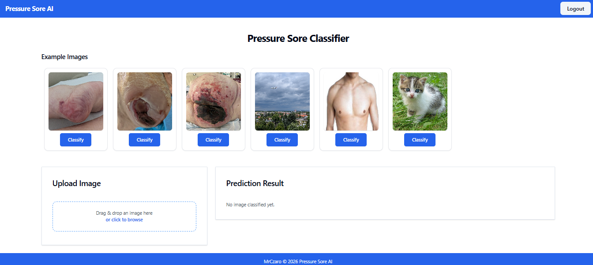
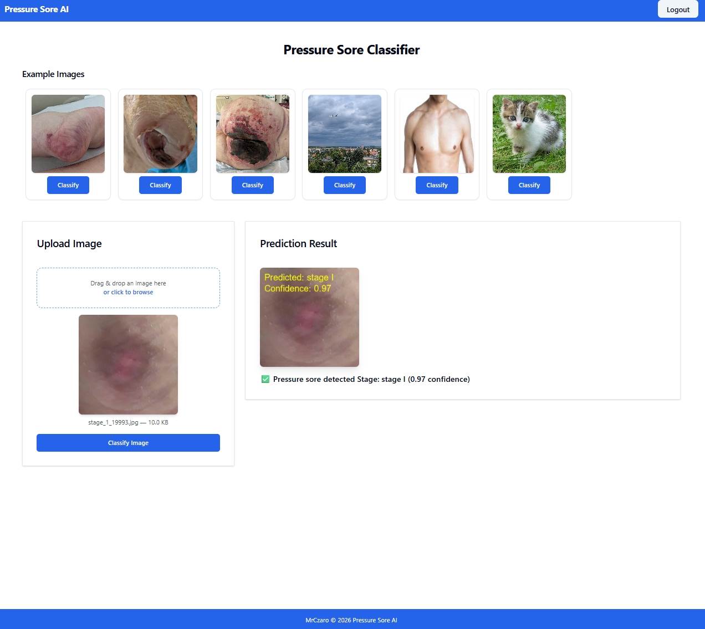
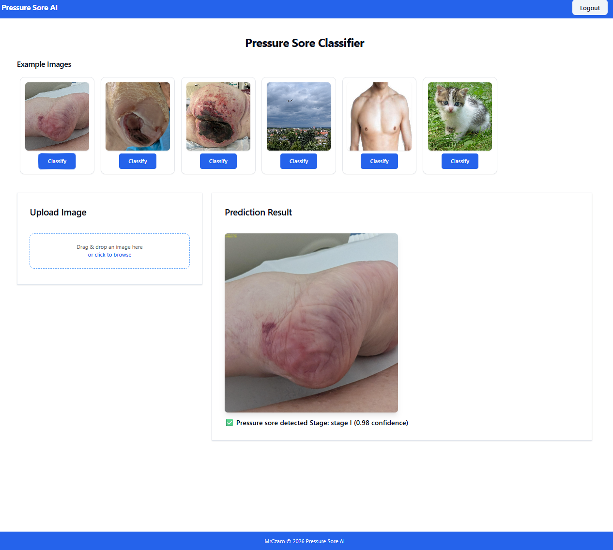
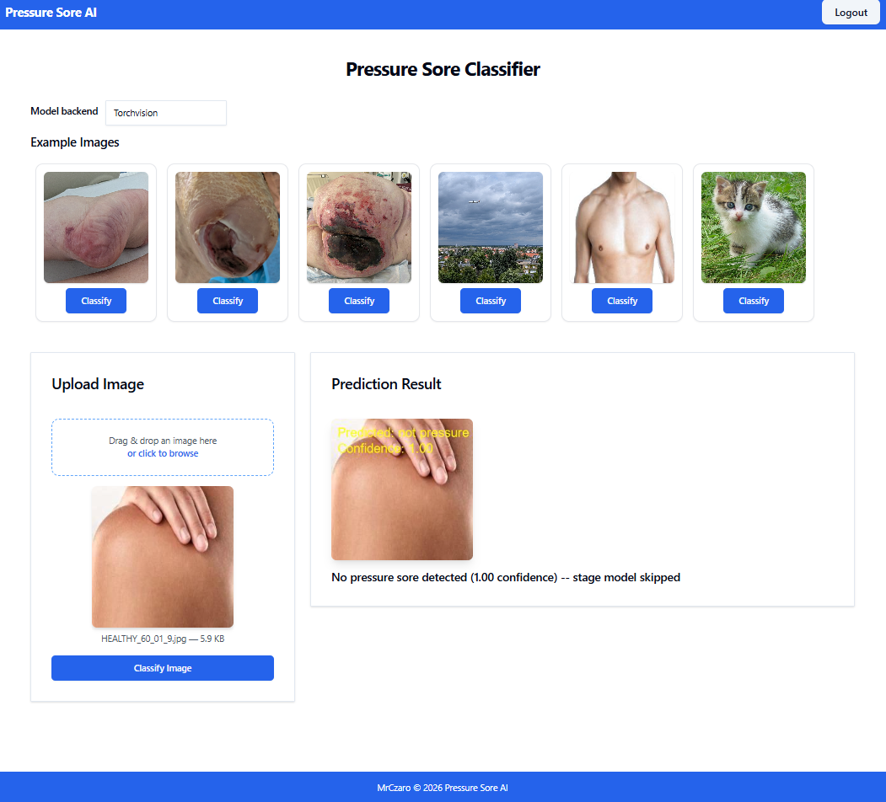
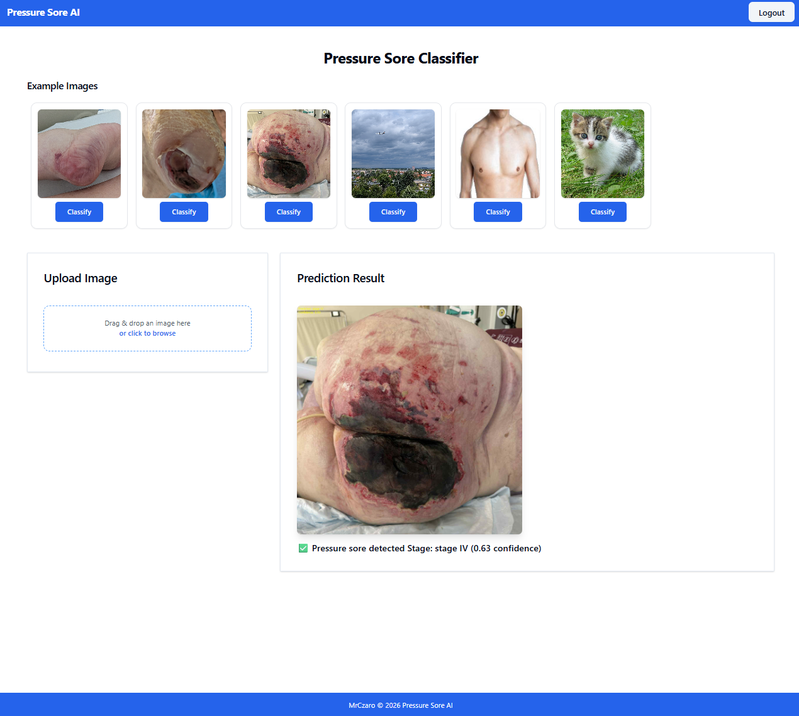
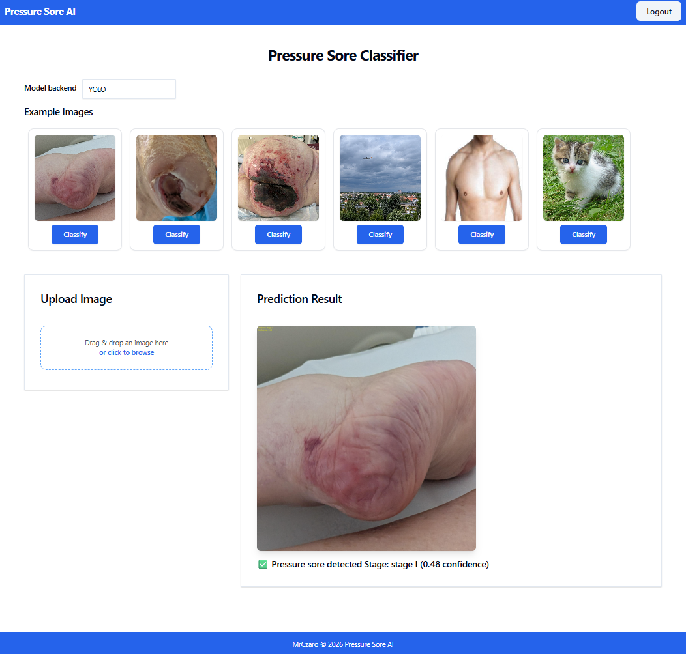
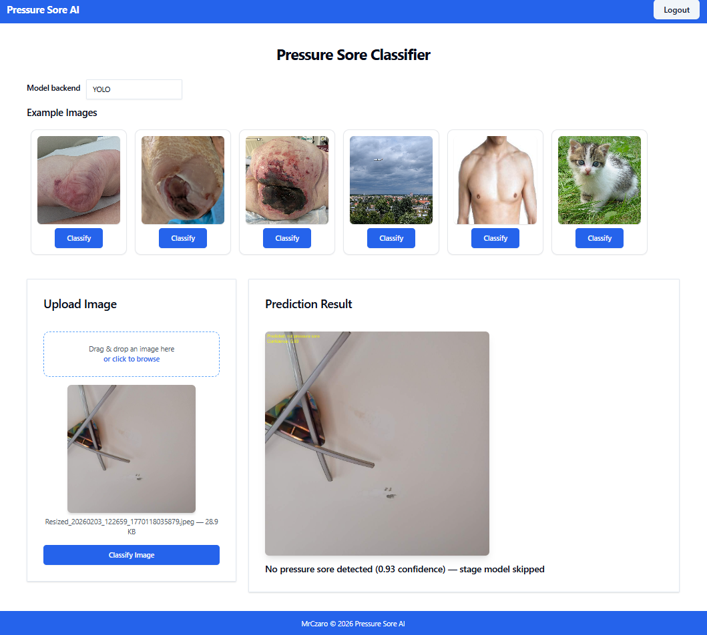

# Pressure Sore AI Classifier 🏥

[](https://www.python.org/downloads/)
[](https://pytorch.org/)
[](https://fastht.ml/)
[](https://opensource.org/license/mit)

Deep learning web application for automated pressure sore (pressure ulcer) detection and severity classification using ensemble neural networks and cascade architecture.


---

## 📸 Application Preview

### User Interface
<table>
  <tr>
    <td width="100%">
      
      <p align="center"><b>Interactive Dashboard</b><br/>Upload images or select from examples</p>
    </td>
    
  </tr>
  <tr>
    <td width="50%">
      
      <p align="center"><b>Drag & Drop Upload</b><br/>Seamless file handling with preview</p>
    </td>
    <td width="50%">
      
      <p align="center"><b>Drag & Drop Upload</b><br/>Seamless file handling with preview</p>
    </td>
  </tr>
</table>

### Model Performance
<table>
  <tr>
    <td width="33%">
      
      <p align="center"><b>Stage I Detection</b><br/>Early-stage pressure sore identification</p>
    </td>
    <td width="33%">
      
      <p align="center"><b>Advanced Stage Classification</b><br/>Deep tissue damage assessment</p>
    </td>
    <td width="33%">
      
      <p align="center"><b>Advanced Stage Classification</b><br/>Deep tissue damage assessment</p>
    </td>
  </tr>
</table>

<table>
  <tr>
    <td width="33%">
      
      <p align="center"><b>Negative Classification</b><br/>Accurate rejection of non-pressure sores</p>
    </td>
    <td width="33%">
      
      <p align="center"><b>Negative Classification</b><br/>Accurate rejection of non-pressure sores</p>
    </td>
    <td width="33%">
      
      <p align="center"><b>Negative Classification</b><br/>Accurate rejection of non-pressure sores</p>
    </td>
  </tr>
</table>

---

## 🎯 Project Overview

This project implements a **two-stage cascade deep learning pipeline** for automated pressure sore detection and classification. The system combines multiple state-of-the-art computer vision models in an ensemble architecture to achieve robust performance.

### Medical Context

**Pressure sores (pressure ulcers)** are localized injuries to skin and underlying tissue, typically over bony prominences, caused by prolonged pressure. They are staged from I to IV based on severity:

- **Stage I**: Non-blanchable erythema (redness) of intact skin
- **Stage II**: Partial-thickness skin loss with exposed dermis
- **Stage III**: Full-thickness skin loss (fat visible)
- **Stage IV**: Full-thickness tissue loss (muscle/bone exposed)

Early detection and accurate staging are critical for treatment planning and preventing progression.

---

## ✨ Key Features

### 🧠 Deep Learning Architecture

- **Cascade Classification Pipeline**: Two-stage approach with binary detection followed by multi-class staging
- **Ensemble Modeling**: Combines 5+ neural networks for robust predictions
- **Model Zoo**: 
  - EfficientNet (B0, B1, B3, B4, V2-M)
  - Vision Transformers (ViT-B/16)
  - MaxViT, ConvNeXt, Swin V2
  - Wide ResNet-50, ResNet-50/152
- **Advanced Architectures Tested**:
  - YOLOv8 and YOLOv11 (Ultralytics)
  - DINOv2 (Meta AI)
  - Custom PyTorch implementations

### 🔬 Cascade Approach

#### Stage 1: Binary Classification
**Objective**: Pressure sore vs. non-pressure sore  
**Models**: 5-model ensemble (ConvNeXt-Tiny, MaxViT-T, EfficientNet-B4, ResNet-50, Swin-V2-T)  
**Output**: Binary decision + confidence score

#### Stage 2: Multi-Class Staging (Conditional)
**Objective**: Classify severity (Stage I/II/III/IV)  
**Activation**: Only runs if Stage 1 detects pressure sore  
**Models**: 2-model ensemble (EfficientNet-B1, EfficientNet-V2-M)  
**Output**: Stage prediction + confidence score

### 🌐 Web Application

- **FastHTML Framework**: Modern Python web framework with HTMX
- **MonsterUI Components**: Beautiful, responsive Tailwind CSS + DaisyUI interface
- **Real-Time Inference**: Instant predictions via drag-and-drop or example selection
- **User Authentication**: Secure login/signup with bcrypt password hashing
- **Image Annotation**: Automatic overlay of predictions with confidence scores
- **Mobile Responsive**: Works seamlessly on desktop, tablet, and mobile devices

---

## 🏗️ Architecture

### System Diagram

```
┌─────────────────────┐
│   User Interface    │
│  (FastHTML + HTMX)  │
└──────────┬──────────┘
           │
           ▼
┌─────────────────────────────────────────────────────────────┐
│                    Image Input Pipeline                      │
│  • Upload (Drag & Drop)                                     │
│  • Example Gallery Selection                                │
│  • Preprocessing (Resize, Normalize)                        │
└──────────┬──────────────────────────────────────────────────┘
           │
           ▼
┌─────────────────────────────────────────────────────────────┐
│              STAGE 1: Binary Classification                  │
│                                                              │
│  ┌──────────────┐  ┌──────────────┐  ┌──────────────┐      │
│  │ ConvNeXt-Tiny│  │  MaxViT-T    │  │EfficientNet  │ ...  │
│  └──────┬───────┘  └──────┬───────┘  └──────┬───────┘      │
│         │                  │                  │              │
│         └──────────────────┴──────────────────┘              │
│                            │                                 │
│                    ┌───────▼────────┐                        │
│                    │   Ensemble     │                        │
│                    │   Averaging    │                        │
│                    └───────┬────────┘                        │
│                            │                                 │
│                    ┌───────▼─────────┐                       │
│                    │  Sigmoid + Vote │                       │
│                    └───────┬─────────┘                       │
│                            │                                 │
│                    Decision: Pressure Sore?                  │
└────────────────────────────┬────────────────────────────────┘
                             │
                ┌────────────┴────────────┐
                │                         │
           NO   │                         │  YES
                │                         │
                ▼                         ▼
    ┌───────────────────┐   ┌─────────────────────────────────┐
    │  Return Negative  │   │ STAGE 2: Multi-Class Staging    │
    │   Classification  │   │                                 │
    └───────────────────┘   │ ┌──────────────┐ ┌────────────┐│
                            │ │EfficientNet  │ │EfficientNet││
                            │ │     B1       │ │   V2-M     ││
                            │ └──────┬───────┘ └──────┬─────┘│
                            │        │                │       │
                            │        └────────┬───────┘       │
                            │                 │               │
                            │         ┌───────▼────────┐      │
                            │         │   Ensemble     │      │
                            │         │   Averaging    │      │
                            │         └───────┬────────┘      │
                            │                 │               │
                            │         ┌───────▼────────┐      │
                            │         │  Softmax Vote  │      │
                            │         └───────┬────────┘      │
                            │                 │               │
                            │         Stage I / II / III / IV │
                            └─────────────────────────────────┘
                                              │
                                              ▼
                                  ┌───────────────────────┐
                                  │   Annotate Image      │
                                  │  (Label + Confidence) │
                                  └───────────────────────┘
                                              │
                                              ▼
                                  ┌───────────────────────┐
                                  │   Return to User      │
                                  │  (Base64-encoded PNG) │
                                  └───────────────────────┘
```

### Data Flow

1. **Input**: User uploads image or selects example
2. **Preprocessing**: Resize to 224×224, normalize (ImageNet statistics)
3. **Binary Ensemble**: 5 models vote → Pressure sore detected?
4. **Conditional Routing**: 
   - If NO → Return "No pressure sore detected"
   - If YES → Proceed to Stage 2
5. **Multi-Class Ensemble**: 2 models vote → Stage I/II/III/IV
6. **Annotation**: Draw prediction + confidence on image
7. **Response**: Display annotated image to user

---

## 🧪 Research & Development

### Experimental Approaches

This project represents iterative research exploring multiple deep learning paradigms:

#### ✅ Current Implementation: Cascade Ensemble
**Architecture**: Binary detection → Multi-class staging  
**Rationale**: Mimics clinical workflow (detect first, then stage)  
**Pros**: High specificity, interpretable confidence scores  
**Challenges**: Stage III/IV differentiation remains difficult

#### 🔬 Alternative Approaches Tested

**1. Binary Cascade with Staged Routing**
```
Binary: Pressure Sore? 
  ├─ YES → Binary: Early (I/II) vs Advanced (III/IV)?
  │           ├─ Early → Binary: Stage I vs Stage II
  │           └─ Advanced → Binary: Stage III vs Stage IV
  └─ NO → Return Negative
```
**Status**: Prototyped, showed promise for Stage III/IV separation  
**Challenge**: Requires  labeled data (one dataset per binary classifier)

**2. YOLOv8/YOLOv11 Object Detection**  
**Approach**: Treat staging as object detection with bounding boxes  
**Status**: Tested with Ultralytics framework  
**Outcome**: Struggled with localization in high-resolution medical images

**3. DINOv2 Self-Supervised Learning**  
**Approach**: Meta's self-supervised ViT for medical domain adaptation  
**Status**: Fine-tuned on collected dataset  
**Outcome**: Competitive performance but high computational cost


### Dataset & Annotation

**Current Dataset**: ~1,000 images collected from public medical databases  
**Sources**: Medical journals, educational resources, research datasets  
**Annotation Status**: In progress - manual staging by clinical guidelines

**Annotation Pipeline**:
1. Image collection and deduplication
2. Manual stage labeling 
3. Data augmentation (rotation, flip, color jitter)
4. Train/validation/test split (70/15/15)

**Future Work**: 
- Collect dataset 
- Collect time-series data (wound progression)

---

## 📊 Model Performance

### Binary Classification (Stage 1)

| Model | Accuracy | Precision | Recall | F1-Score |
|-------|----------|-----------|--------|----------|
| ConvNeXt-Tiny |  |  |  |  |
| MaxViT-T |  |  |  |  |
| EfficientNet-B4 |  |  |  |  |
| ResNet-50 |  |  |  |  |
| Swin-V2-T |  |  |  |  |
| **Ensemble** | **** | **** | **** | **** |

### Multi-Class Staging (Stage 2)

| Model | Accuracy | Macro F1 | Stage III/IV F1 |
|-------|----------|----------|-----------------|
| EfficientNet-B1 |  |  |  |
| EfficientNet-V2-M |  |  |  |
| **Ensemble** | **** | **** | **** |


**Note**: Stage III vs Stage IV remains the most challenging classification pair due to subtle visual differences requiring clinical context.

---

## 🚀 Getting Started

### Prerequisites

```bash
Python 3.11+
PyTorch 2.0+
CUDA-capable GPU (recommended, CPU supported)
8GB+ RAM
```

### Installation

1. **Clone the repository**
```bash
git clone https://github.com/MrCzaro/PS_Classifier.git
cd PS_Classifier
```

2. **Create virtual environment**
```bash
python -m venv venv

# On Windows:
venv\Scripts\activate

# On macOS/Linux:
source venv/bin/activate
```

3. **Install dependencies**
```bash
pip install -r requirements.txt
```

4. **Obtain model weights** ⚠️

**Model weights are NOT included in this repository** due to size constraints.

**For access to weights**:
```
📧 Email: [your-email@example.com]
💬 Subject: "PS_Classifier Model Weights Request"
📝 Include: Your intended use case (evaluation, research, etc.)
```

Once obtained, place the `.pth` files in the `models/` directory:

```bash
# Create models directory
mkdir models

# Add your downloaded weights
# models/
# ├── final_model_ConvNeXt_Tiny_v2_model_head_mlp_binary_StepLR.pth
# ├── final_model_MaxVit_T_v2_model_head_linear_binary_CosineAnnealingLR.pth
# └── ... (5 more files)
```

**Alternative**: You can train your own models using the architecture definitions in `ps_classifier.py`.

5. **Initialize database**
```bash
# Database auto-creates on first run
# To reset:
rm users.db
```

6. **Run the application**
```bash
python main.py
```

7. **Access the web interface**
```
Open browser: http://localhost:5001
```

### First-Time Setup

1. **Create account**: Navigate to signup page
2. **Test with examples**: Click any example image to classify
3. **Upload custom image**: Drag and drop your own pressure sore images
4. **Review predictions**: See annotated results with confidence scores

---
## 🔑 Obtaining Model Weights

### Why Weights Are Not in Repository

Model weights (~800MB total) are **excluded from this GitHub repository** for several reasons:

1. **File Size Constraints**: GitHub has 100MB per-file limits
2. **Repository Performance**: Keeps repo lightweight for cloning
3. **Version Control**: Binary files don't benefit from Git
4. **Controlled Distribution**: Ensures proper attribution and use

### How to Get Weights

**For Recruiters, Researchers, or Collaborators:**

I'm happy to share model weights for legitimate purposes:

```
📧 Email: [cezary.tubacki@gmail.com]
💬 Subject: "PS_Classifier Weights Request"
📝 Please include:
   - Your name and affiliation
   - Intended use case (portfolio review, research, evaluation, etc.)
   - Preferred delivery method (Google Drive, Dropbox, direct transfer)
```
---
### Alternative: Train Your Own

If you prefer to train from scratch:

1. Use the architecture definitions in `ps_classifier.py`
2. Collect and annotate your own dataset
3. Follow standard PyTorch training pipeline
4. Save weights with `torch.save(model.state_dict(), 'path.pth')`

---

## 💻 Usage

### Web Interface

**Example Classification**:
1. Select an example image from the gallery
2. Click "Classify" button
3. View annotated result with prediction + confidence

**Custom Upload**:
1. Drag image into upload zone (or click to browse)
2. Preview appears automatically
3. Click "Classify Image" button
4. Results display in prediction panel

### API Usage (Programmatic)

```python
from ps_classifier import classify_image_ps
from PIL import Image

# Load image
img_path = "path/to/pressure_sore.jpg"
img = Image.open(img_path).convert("RGB")

# Classify
annotated_img, message = classify_image_ps(img_path)

# Display results
print(message)
# Output: "✅ Pressure sore detected\nStage: stage III \n(0.87 confidence)"

annotated_img.show()  # View annotated image
```

### Batch Processing

```python
import os
from pathlib import Path
from ps_classifier import classify_image_ps

# Process directory
input_dir = Path("images/to_classify")
output_dir = Path("results/annotated")
output_dir.mkdir(exist_ok=True)

for img_file in input_dir.glob("*.jpg"):
    result_img, message = classify_image_ps(str(img_file))
    
    if result_img:
        # Save annotated image
        output_path = output_dir / img_file.name
        result_img.save(output_path)
        
        # Log results
        with open(output_dir / "predictions.txt", "a") as f:
            f.write(f"{img_file.name}: {message}\n")
```

---

## 🛠️ Technical Stack

### Core Technologies

- **Backend**: [FastHTML](https://fastht.ml/) - Modern Python web framework
- **Frontend**: [MonsterUI](https://monsterui.org/) - Tailwind CSS + DaisyUI components
- **Deep Learning**: [PyTorch](https://pytorch.org/) - Neural network framework
- **Computer Vision**: 
  - TorchVision (pretrained models)
  - Albumentations (augmentation)
  - PIL (image processing)
- **Database**: SQLite (user management)
- **Auth**: Bcrypt (password hashing)
- **Real-time**: HTMX (dynamic updates)

### Model Architecture Details

**Binary Models** (5 models):
```python
binary_models_settings = {
    "ConvNeXt_Tiny": ["path/to/weights", "mlp"],
    "MaxVit_T": ["path/to/weights", "linear"],
    "EfficientNet_B4": ["path/to/weights", "mlp"],
    "ResNet50": ["path/to/weights", "mlp"],
    "Swin_V2_T": ["path/to/weights", "linear"]
}
```

**Stage Models** (2 models):
```python
stage_models_settings = {
    "EfficientNet_B1": ["path/to/weights", "linear"],
    "EfficientNet_V2_M": ["path/to/weights", "linear"]
}
```

**Training Configuration**:
- Optimizer: AdamW with weight decay
- Schedulers: StepLR and CosineAnnealingLR
- Loss: BCEWithLogitsLoss (binary), CrossEntropyLoss (multi-class)
- Augmentation: Rotation, flip, color jitter, cutout
- Batch size: 32 (binary), 16 (multi-class)
- Input resolution: 224×224
- Normalization: ImageNet statistics

---

## 📁 Project Structure

```
PS_Classifier/
├── main.py                    # FastHTML app with routes
├── ps_classifier.py           # Core ML pipeline (models + inference)
├── components.py              # UI components (cards, forms, layout)
├── passwords_helper.py        # Bcrypt password utilities
├── requirements.txt           # Python dependencies
├── users.db                   # SQLite database (auto-generated)
├── models/                    # Model weights (.pth files)
│   ├── final_model_ConvNeXt_Tiny_*.pth
│   ├── final_model_MaxVit_T_*.pth
│   ├── final_model_EfficientNet_B4_*.pth
│   ├── final_model_ResNet50_*.pth
│   ├── final_model_Swin_V2_T_*.pth
│   ├── multiclass_EfficientNet_B1_*.pth
│   └── multiclass_EfficientNet_V2_M_*.pth
├── static/                    # Images and assets
│   ├── pressure_1.jpg         # Example pressure sores
│   ├── pressure_2.jpg
│   ├── pressure_3.jpg
│   ├── no_pressure_1.jpg      # Example non-pressure sores
│   ├── no_pressure_2.jpg
│   ├── no_pressure_3.jpg
│   ├── error_picture.jpg      # Fallback error image
│   ├── favicon.ico
│   └── preview.js             # Client-side upload preview
├── docs/                      # Documentation and screenshots
│   └── screenshots/
│       ├── demo_ss_1.png
│       ├── demo_ss_2.png
│       └── ...
└── README.md                  e
```
---

## 🔒 Security & Privacy

**Medical Image Handling**:
- Images are NOT stored permanently (deleted after classification)
- No EXIF data is retained
- No patient identifiable information (PII) is collected

**User Authentication**:
- Bcrypt password hashing 
- Session-based auth with signed cookies
- SQL injection prevention via parameterized queries

**HIPAA Compliance Notes**:
- This is a demonstration/research tool
- NOT certified for clinical use without validation
- Users must ensure compliance when deploying

---


## 🤝 Contributing

Contributions welcome! This is a portfolio/research project, but I'm happy to collaborate.

**Ways to Contribute**:
- 🐛 Report bugs or issues
- 💡 Suggest new features or architectures
- 📊 Share datasets (with proper licensing)
- 📝 Improve documentation
- 🔬 Validate models on your data
- 🎨 Enhance UI/UX design

**Contact**:
- GitHub Issues: [PS_Classifier/issues](https://github.com/MrCzaro/PS_Classifier/issues)
- Email: [cezary.tubacki@gmail.com] 
---

## 📄 License

This project is licensed under the MIT License - see [LICENSE](https://opensource.org/license/mit) file for details.

### Medical Disclaimer

**⚠️ IMPORTANT**:  
This software is provided **"as is"** for **research and educational purposes only**. It is:

- ❌ **NOT** a medical device
- ❌ **NOT** certified for clinical diagnosis
- ❌ **NOT** a substitute for professional medical judgment
- ❌ **NOT** validated in clinical trials

**Always consult licensed healthcare professionals for medical diagnosis and treatment.**

Use at your own risk. The authors assume no liability for decisions made based on this tool's output.

---

## 🙏 Acknowledgments

- **PyTorch Team**: For the incredible deep learning framework
- **FastHTML Creators**: For making web development enjoyable again
- **Medical Community**: For publicly available educational resources
- **Researchers**: Authors of pretrained models (ImageNet, etc.)
- **Open Source**: Standing on the shoulders of giants

---


### Current Status: ✅ v1.0 - Demo

**Completed**:
- ✅ Two-stage cascade architecture implemented
- ✅ 7-model ensemble deployed
- ✅ Web app with authentication
- ✅ Real-time inference (<200ms)
- ✅ Mobile-responsive UI


---

## 📞 Contact & Support

**Author**: MrCzaro  
**GitHub**: [@MrCzaro](https://github.com/MrCzaro)  
**Project Link**: [PS_Classifier](https://github.com/MrCzaro/PS_Classifier)

**For**:
- Bug reports → [GitHub Issues](https://github.com/MrCzaro/PS_Classifier/issues)
- Feature requests → [GitHub Discussions](https://github.com/MrCzaro/PS_Classifier/discussions)


---

## ⭐ Star History

If you find this project useful, please consider giving it a star! It helps others discover this work.

[](https://star-history.com/#MrCzaro/PS_Classifier&Date)

---


