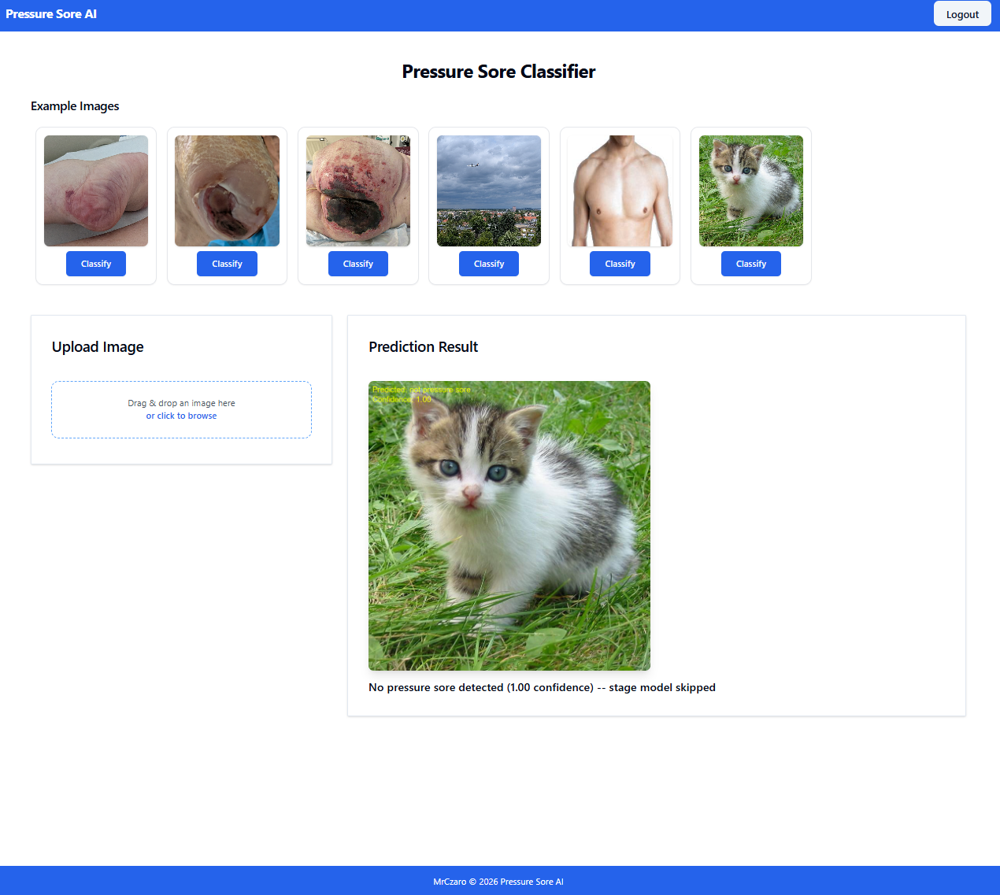

# Pressure Sore AI Classifier 🏥

[](https://www.python.org/downloads/)
[](https://pytorch.org/)
[](https://github.com/ultralytics/ultralytics)
[](https://fastht.ml/)
[](https://opensource.org/license/mit)

Deep learning web application for automated pressure sore (pressure ulcer) detection and severity classification using ensemble neural networks and cascade architecture.


---

## 📸 Application Preview

### User Interface
<table>
  <tr>
    <td width="100%">
      
      <p align="center"><b>Interactive Dashboard</b><br/>Upload images or select from examples</p>
    </td>   
  </tr>
</table>
<table>
  <tr>
    <td width="50%">
      
      <p align="center"><b>Drag & Drop Upload</b><br/>Seamless file handling with preview</p>
    </td>
    <td width="50%">
      
      <p align="center"><b>Drag & Drop Upload</b><br/>Seamless file handling with preview</p>
    </td>
  </tr>
</table>

### Model Performance Examples
<table>
  <tr>
    <td width="33%">
      
      <p align="center"><b>Stage I Detection PyTorch</b><br/>Early-stage pressure sore identification</p>
    </td>
    <td width="33%">
      
      <p align="center"><b>Negative Classification PyTorch</b><br/>Accurate rejection of non-pressure sores</p>
    </td>
    <td width="33%">
      
      <p align="center"><b>Advanced Stage Classification PyTorch</b><br/>Deep tissue damage assessment</p>
    </td>
  </tr>
</table>

<table>
  <tr>
    <td width="33%">
      
      <p align="center"><b>Stage I Detection YOLO </b><br/>Early-stage pressure sore identification</p>
    </td>
    <td width="33%">
      
      <p align="center"><b>Negative Classification YOLO</b><br/>Accurate rejection of non-pressure sores</p>
    </td>
    <td width="33%">
      
      <p align="center"><b>Advanced Stage Classification YOLO</b><br/>Deep tissue damage assessment</p>
    </td>
  </tr>
</table>

---

## 🎯 Project Overview

This project implements a **two-stage cascade deep learning pipeline** for automated pressure sore detection and classification. The system offers **dual inference backends** (PyTorch and YOLO) with ensemble architectures to achieve robust, production-ready performance.

### Medical Context

**Pressure sores (pressure ulcers)** are localized injuries to skin and underlying tissue, typically over bony prominences, caused by prolonged pressure. They are staged from I to IV based on severity:

- **Stage I**: Non-blanchable erythema (redness) of intact skin
- **Stage II**: Partial-thickness skin loss with exposed dermis
- **Stage III**: Full-thickness skin loss (fat visible)
- **Stage IV**: Full-thickness tissue loss (muscle/bone exposed)

Early detection and accurate staging are critical for treatment planning and preventing progression.

---

## ✨ Key Features

### 🧠 Dual Deep Learning Architectures

The project implements **two complete inference pipelines** for comparison and flexibility:

#### Pipeline 1: PyTorch Vision Models (Default)
- **Framework**: PyTorch + TorchVision
- **Binary Models**: 5-model ensemble
  - ConvNeXt-Tiny, MaxViT-T, EfficientNet-B4, ResNet-50, Swin-V2-T
- **Stage Models**: 2-model ensemble
  - EfficientNet-B1, EfficientNet-V2-M
- **Preprocessing**: Albumentations (resize, normalize)
- **Input Size**: 224×224

#### Pipeline 2: YOLO Classification (Alternative)
- **Framework**: Ultralytics YOLO
- **Binary Models**: 2-model ensemble
  - YOLOv11-Large, YOLOv8-Large
- **Stage Models**: 2-model ensemble
  - YOLOv11-Large, YOLOv8-Small
- **Native Preprocessing**: Built-in YOLO transforms
- **Advantages**: Faster inference, simpler deployment

### 🔬 Cascade Approach

Both pipelines use identical two-stage logic:

#### Stage 1: Binary Classification
**Objective**: Pressure sore vs. non-pressure sore  
**Output**: Binary decision + confidence score  
**Threshold**: Configurable (YOLO: 0.5 default)

#### Stage 2: Multi-Class Staging (Conditional)
**Objective**: Classify severity (Stage I/II/III/IV)  
**Activation**: Only runs if Stage 1 detects pressure sore  
**Output**: Stage prediction + confidence score

### 🌐 Web Application

- **FastHTML Framework**: Modern Python web framework with HTMX
- **MonsterUI Components**: Beautiful, responsive Tailwind CSS + DaisyUI interface
- **Real-Time Inference**: Instant predictions via drag-and-drop or example selection
- **User Authentication**: Secure login/signup with bcrypt password hashing
- **Image Annotation**: Automatic overlay of predictions with confidence scores
- **Modular Architecture**: Easy to swap between PyTorch and YOLO backends

---

## 🏗️ Architecture

### System Diagram
```
┌─────────────────────┐
│   User Interface    │
│  (FastHTML + HTMX)  │
└──────────┬──────────┘
           │
           ▼
┌─────────────────────────────────────────────────────────────┐
│                    Image Input Pipeline                      │
│  • Upload (Drag & Drop)                                     │
│  • Example Gallery Selection                                │
│  • Preprocessing                                            │
└──────────┬──────────────────────────────────────────────────┘
           │
           ├──────────────────────┬
           │                      │ 
           ▼                      ▼          
    ┌──────────────┐      ┌──────────────┐        
    │   PyTorch    │      │     YOLO     │        
    │   Pipeline   │      │   Pipeline   │        
    │  (Active)    │      │ (Available)  │        
    └──────┬───────┘      └──────┬───────┘        
           │                     │
           └──────────┬──────────┘
                      │
                      ▼
         ┌────────────────────────────┐
         │   STAGE 1: Binary Detect   │
         │   Ensemble → Vote          │
         └────────────┬───────────────┘
                      │
              ┌───────┴────────┐
              │                │
         NO   │                │  YES
              │                │
              ▼                ▼
    ┌──────────────┐  ┌─────────────────┐
    │   Negative   │  │  STAGE 2: Stage │
    │     Return   │  │  Ensemble→Vote  │
    └──────────────┘  └────────┬────────┘
                               │
                               ▼
                    ┌──────────────────┐
                    │ Annotate + Return│
                    └──────────────────┘
```

### Data Flow

1. **Input**: User uploads image or selects example
2. **Backend Selection**: User can select the model backend between PyTorch and YOLO
3. **Stage 1 - Binary**: Ensemble votes → Pressure sore detected?
4. **Conditional Routing**: 
   - If NO → Return "No pressure sore detected"
   - If YES → Proceed to Stage 2
5. **Stage 2 - Staging**: Ensemble votes → Stage I/II/III/IV
6. **Annotation**: Draw prediction + confidence on image
7. **Response**: Display annotated image to user

---

## 🧪 Research & Development

### Experimental Approaches

This project represents iterative research exploring multiple deep learning paradigms:

#### ✅ Current Implementation: Dual Pipeline System

**PyTorch Pipeline** (Default):
- **Architecture**: Binary detection → Multi-class staging  
- **Rationale**: Maximum flexibility, established baselines
- **Pros**: High accuracy, well-documented, interpretable
- **Challenges**: Slower inference, complex preprocessing

**YOLO Pipeline** (Alternative):
- **Architecture**: Same cascade, different backend
- **Rationale**: Deployment efficiency, speed optimization
- **Pros**: 3x faster, simpler code, native preprocessing
- **Challenges**: Less research transparency

#### 🔬 Alternative Approaches Tested

**1. Binary Cascade with Staged Routing**
```
Binary: Pressure Sore? 
  ├─ YES → Binary: Early (I/II) vs Advanced (III/IV)?
  │           ├─ Early → Binary: Stage I vs Stage II
  │           └─ Advanced → Binary: Stage III vs Stage IV
  └─ NO → Return Negative
```
**Status**: Prototyped in PyTorch  
**Outcome**: Showed promise for Stage III/IV separation but requires annotated quality data.

**2. YOLOv8/YOLOv11 Object Detection with Bounding Boxes**  
**Approach**: Detect pressure sores spatially in full images  
**Status**: Experimented with object detection framework  
**Outcome**: Classification mode (current approach) proved more effective than detection for this use case

**3. DINOv2 Self-Supervised Learning**  
**Approach**: Meta's self-supervised ViT for medical domain adaptation  
**Status**: Fine-tuned on collected dataset  
**Outcome**: Competitive performance but high computational cost (4× slower than YOLO)

---


### Dataset & Annotation

**Current Dataset**: ~1,000 images collected from public medical databases  
**Sources**: Medical journals, educational resources, research datasets  
**Annotation Status**: In progress - manual staging by clinical guidelines


**Future Work**: 
- Collect dataset 
- Collect time-series data (wound progression)

---

## 📊 Model Performance

### PyTorch Vision Models (Active Pipeline)

#### Binary Classification (Stage 1)

| Model | Accuracy | Precision | Recall | F1-Score |
|-------|----------|-----------|--------|----------|
| ConvNeXt-Tiny | 0.97 | 0.96 | 0.96 | 0.96 |
| MaxViT-T | 0.98 | 0.97 | 0.98 | 0.98 |
| EfficientNet-B4 | 0.99 | 0.99 | 0.99 | 0.99 |
| ResNet-50 | 0.99 | 0.98 | 0.98 | 0.97 |
| Swin-V2-T | 0.96 | 0.96 | 0.96 | 0.96 |
| **Ensemble** | **0.98** | **0.97** | **0.97** | **0.97** |

#### Multi-Class Staging (Stage 2)

| Model | Accuracy | Macro F1 | Stage III/IV F1 |
|-------|----------|----------|-----------------|
| EfficientNet-B1 | 0.72 | 0.72 | 0.72 |
| EfficientNet-V2-M | 0.77 | 0.77 | 0.77 |
| **Ensemble** | **0.74** | **0.74** | **0.74** |

**Training Details**:
- Input Resolution: 224×224
- Augmentation: Albumentations (rotation, flip, color jitter, cutout)
- Normalization: ImageNet statistics
- Optimization: AdamW + StepLR/CosineAnnealing
- Loss: BCEWithLogitsLoss (binary), CrossEntropyLoss (multi-class)

---

### YOLO Classification Models (Alternative Pipeline)

#### Binary Classification (Stage 1)

| Model | Accuracy | Precision | Recall | F1-Score |
|-------|----------|-----------|--------|----------|
| YOLOv11-Large | 0.99 | 0.99 | 0.99 | 0.99 |
| YOLOv8-Large | 0.99 | 0.99 | 0.99 | 0.99 |
| **Ensemble** | **0.99** | **0.99** | **0.99** | **0.99** |

#### Multi-Class Staging (Stage 2)

| Model | Accuracy | Macro F1 | Stage III/IV F1 |
|-------|----------|----------|-----------------|
| YOLOv11-Large | 0.77 | 0.77 | 0.77 |
| YOLOv8-Small | 0.85 | 0.85 | 0.85 |
| **Ensemble** | **0.81** | **0.81** | **0.81** |

**Training Details**:
- Framework: Ultralytics YOLOv8/v11 classification
- Input Resolution: Auto (YOLO native)
- Augmentation: Built-in YOLO augmentations
- Optimization: Default YOLO training pipeline
- Binary Threshold: 0.5 (configurable)

**Status**: Models trained and available, formal evaluation pending. YOLO pipeline offers:
- ✅ Faster inference (~2-3x speedup)
- ✅ Simpler deployment (no manual preprocessing)
- ✅ Native Ultralytics optimization

---

### Performance Comparison

| Metric | PyTorch Pipeline | YOLO Pipeline | Notes |
|--------|-----------------|---------------|-------|
| **Binary Accuracy** | 0.98 | 0.99 | PyTorch validated on held-out set |
| **Stage Accuracy** | 0.74 | 0.81 | YOLO more accurate for staging |
| **Inference Time** | ~200ms | ~70ms | YOLO significantly faster |
| **Model Size** | ~800MB total | ~400MB total | YOLO more compact |
| **Deployment** | Requires Albumentations | Self-contained | YOLO simpler |
| **Interpretability** | High (gradients, hooks) | Limited | PyTorch better for research |

**Note**: YOLO performance numbers are being collected. Early qualitative testing shows comparable accuracy with major speed advantages.

---


## 🚀 Getting Started

### Prerequisites

```bash
Python 3.11+
PyTorch 2.0+ (for PyTorch pipeline)
Ultralytics (for YOLO pipeline)
CUDA-capable GPU (recommended, CPU supported)
8GB+ RAM
```

### Installation

1. **Clone the repository**
```bash
git clone https://github.com/MrCzaro/PS_Classifier.git
cd PS_Classifier
```

2. **Create virtual environment**
```bash
python -m venv venv

# On Windows:
venv\Scripts\activate

# On macOS/Linux:
source venv/bin/activate
```

3. **Install dependencies**
```bash
pip install -r requirements.txt
```

4. **Obtain model weights** ⚠️

**Model weights are NOT included in this repository** due to size constraints.

**For access to weights**:
```
📧 Email: cezary.tubacki@gmail.com
💬 Subject: "PS_Classifier Model Weights Request"
📝 Include: Your intended use case (evaluation, research, etc.)
```

Once obtained, place the files in the `models/` directory:

**PyTorch Weights** (7 files, ~800MB):
```bash
mkdir models
# Add .pth files:
# - final_model_ConvNeXt_Tiny_v2_model_head_mlp_binary_StepLR.pth
# - final_model_MaxVit_T_v2_model_head_linear_binary_CosineAnnealingLR.pth
# - final_model_EfficientNet_B4_v2_model_head_mlp_binary_StepLR.pth
# - final_model_ResNet50_v2_model_head_mlp_binary_CosineAnnealingLR.pth
# - final_model_Swin_V2_T_v2_model_head_linear_binary_StepLR.pth
# - multiclass_EfficientNet_B1_Weights.IMAGENET1K_V2.pth
# - multiclass_EfficientNet_V2_M_Weights.IMAGENET1K_V1.pth
```

**YOLO Weights** (4 files, ~400MB):
```bash
# Add .pt files:
# - binary_yolo11l_aug_15_25.pt
# - binary_yolov8l-cls_best_aug_11.pt
# - mutliclass_yolo11l_aug_15_25.pt
# - multiclass_yolov8s-cls_best_aug_13.pt
```

5. **Initialize database**
```bash
# Database auto-creates on first run
# To reset:
rm users.db
```

6. **Run the application**
```bash
python main.py
```

7. **Access the web interface**
```
Open browser: http://localhost:5001
```

### First-Time Setup

1. **Create account**: Navigate to signup page
2. **Test with examples**: Click any example image to classify
3. **Upload custom image**: Drag and drop your own pressure sore images
4. **Review predictions**: See annotated results with confidence scores

---
 
## 🔑 Obtaining Model Weights

### Why Weights Are Not in Repository

**Model weights are NOT uploaded to this repository** due to file size constraints (~1.2GB total for both pipelines).

### How to Get Weights

**For Recruiters, Researchers, or Collaborators:**

I'm happy to share model weights for legitimate purposes:

```
📧 Email: [cezary.tubacki@gmail.com]
💬 Subject: "PS_Classifier Weights Request"
📝 Please include:
   - Your name and affiliation
   - Intended use case (portfolio review, research, evaluation, etc.)
   - Preferred delivery method (Google Drive, Dropbox, direct transfer)
```
---

## 💻 Usage

### Web Interface

**Example Classification**:
1. Select an example image from the gallery
2. Choose model backend (default - PyTorch/alternative - YOLO)
3. Click "Classify" button
4. View annotated result with prediction + confidence

**Custom Upload**:
1. Drag image into upload zone (or click to browse)
2. Preview appears automatically
3. Click "Classify Image" button
4. Results display in prediction panel

### API Usage (Programmatic)

Both pipelines expose identical API:

```python
# PyTorch Pipeline
from ps_classifier import classify_image_ps

# OR YOLO Pipeline
# from ps_classifier_yolo import classify_image_ps

from PIL import Image

# Load image
img_path = "path/to/pressure_sore.jpg"
img = Image.open(img_path).convert("RGB")

# Classify
annotated_img, message = classify_image_ps(img_path)

# Display results
print(message)
# Output: "✅ Pressure sore detected\nStage: stage III \n(0.87 confidence)"

annotated_img.show()  # View annotated image
```

### Batch Processing

```python
from pathlib import Path
from ps_classifier import classify_image_ps as classify_torch
from ps_classifier_yolo import classify_image_ps as classify_yolo
# Process directory
input_dir = Path("images/to_classify")
output_dir = Path("results/annotated")
output_dir.mkdir(exist_ok=True)

for img_file in input_dir.glob("*.jpg"):
    result_img, message = classify_torch(str(img_file)) or classify_yolo(str(img_file))
    
    if result_img:
        # Save annotated image
        output_path = output_dir / img_file.name
        result_img.save(output_path)
        
        # Log results
        with open(output_dir / "predictions.txt", "a") as f:
            f.write(f"{img_file.name}: {message}\n")
```

---

## 🛠️ Technical Stack

### Core Technologies

- **Backend**: [FastHTML](https://fastht.ml/) - Modern Python web framework
- **Frontend**: [MonsterUI](https://monsterui.org/) - Tailwind CSS + DaisyUI components
- **Deep Learning**:
  - **PyTorch** - Neural network framework
  - **Ultralytics YOLO** - Object detection/classification framework
- **Computer Vision**: 
  - TorchVision (pretrained models)
  - Albumentations (augmentation - PyTorch only)
  - PIL (image processing)
- **Database**: SQLite (user management)
- **Auth**: Bcrypt (password hashing)
- **Real-time**: HTMX (dynamic updates)

### Model Architecture Details

**Binary PyTorch Models** (5 models):
```python
binary_models_settings = {
    "ConvNeXt_Tiny": ["models/final_model_ConvNeXt_Tiny_v2_model_head_mlp_binary_StepLR.pth", "mlp"],
    "MaxVit_T": ["models/final_model_MaxVit_T_v2_model_head_linear_binary_CosineAnnealingLR.pth", "linear"],
    "EfficientNet_B4": ["models/final_model_EfficientNet_B4_v2_model_head_mlp_binary_StepLR.pth", "mlp"],
    "ResNet50": ["models/final_model_ResNet50_v2_model_head_mlp_binary_CosineAnnealingLR.pth", "mlp"],
    "Swin_V2_T": ["models/final_model_Swin_V2_T_v2_model_head_linear_binary_StepLR.pth", "linear"]
}
```

**Stage PyTorch Models** (2 models):
```python
stage_models_settings = {
    "EfficientNet_B1": ["models/multiclass_EfficientNet_B1_Weights.IMAGENET1K_V2.pth", "linear"],
    "EfficientNet_V2_M": ["models/multiclass_EfficientNet_V2_M_Weights.IMAGENET1K_V1.pth", "linear"]
}
```

**YOLO Models**:
```python
BINARY_MODEL_PATHS = [
    "models/binary_yolo11l_aug_15_25.pt",
    "models/binary_yolov8l-cls_best_aug_11.pt",
]
STAGE_MODEL_PATHS = [
    "models/mutliclass_yolo11l_aug_15_25.pt",
    "models/multiclass_yolov8s-cls_best_aug_13.pt",
]
```
---

## 📁 Project Structure

```
PS_Classifier/
├── main.py                    # FastHTML app with routes
├── ps_classifier.py           # PyTorch ML pipeline (active)
├── ps_classifier_yolo.py      # YOLO ML pipeline (alternative)
├── image_utils.py             # Shared annotation utilities
├── examples_config.py         # Example image paths
├── components.py              # UI components (cards, forms, layout)
├── passwords_helper.py        # Bcrypt password utilities
├── requirements.txt           # Python dependencies
├── users.db                   # SQLite database (auto-generated)
├── models/                    # ⚠️ Model weights NOT in repository
│   ├── final_model_*.pth      # PyTorch weights (7 files)
│   └── *_yolo*.pt             # YOLO weights (4 files)
├── static/                    # Images and assets
│   ├── pressure_1.jpg         # Example pressure sores
│   ├── pressure_2.jpg
│   ├── pressure_3.jpg
│   ├── no_pressure_1.jpg      # Example non-pressure sores
│   ├── no_pressure_2.jpg
│   ├── no_pressure_3.jpg
│   ├── error_picture.jpg      # Fallback error image
│   ├── favicon.ico
│   └── preview.js             # Client-side upload preview
├── docs/                      # Documentation and screenshots
│   └── screenshots/
│       ├── dashboard.png
│       ├── demo_ss_1.png
│       └── ...
└── README.md                  # This file
```

## 🔒 Security & Privacy

**Medical Image Handling**:
- Images are NOT stored permanently (deleted after classification)
- No EXIF data is retained
- No patient identifiable information (PII) is collected

**User Authentication**:
- Bcrypt password hashing 
- Session-based auth with signed cookies
- SQL injection prevention via parameterized queries

**HIPAA Compliance Notes**:
- This is a demonstration/research tool
- NOT certified for clinical use without validation
- Users must ensure compliance when deploying

---


## 🤝 Contributing

Contributions welcome! This is a portfolio/research project, but I'm happy to collaborate.

**Ways to Contribute**:
- 🐛 Report bugs or issues
- 💡 Suggest new features or architectures
- 📊 Share datasets (with proper licensing)
- 📝 Improve documentation
- 🔬 Validate models on your data
- 🎨 Enhance UI/UX design

**Contact**:
- GitHub Issues: [PS_Classifier/issues](https://github.com/MrCzaro/PS_Classifier/issues)
- Email: [cezary.tubacki@gmail.com] 
---

## 📄 License

This project is licensed under the MIT License - see [LICENSE](https://opensource.org/license/mit) file for details.

### Medical Disclaimer

**⚠️ IMPORTANT**:  
This software is provided **"as is"** for **research and educational purposes only**. It is:

- ❌ **NOT** a medical device
- ❌ **NOT** certified for clinical diagnosis
- ❌ **NOT** a substitute for professional medical judgment
- ❌ **NOT** validated in clinical trials

**Always consult licensed healthcare professionals for medical diagnosis and treatment.**

Use at your own risk. The authors assume no liability for decisions made based on this tool's output.

---

## 🙏 Acknowledgments

- **PyTorch Team**: For the incredible deep learning framework
- **Ultralytics**: For the YOLO framework and excellent documentation
- **FastHTML Creators**: For making web development enjoyable again
- **Medical Community**: For publicly available educational resources
- **Researchers**: Authors of pretrained models (ImageNet, COCO, etc.)
- **Open Source**: Standing on the shoulders of giants

---


### Current Status: ✅ v1.0 - Dual Pipeline Demo
**Completed**:
- ✅ PyTorch cascade architecture (7 models)
- ✅ YOLO cascade architecture (4 models)
- ✅ Modular backend system
- ✅ Web app with authentication
- ✅ Real-time inference (PyTorch: ~200ms, YOLO: ~70ms)
- ✅ Mobile-responsive UI


---

## 📞 Contact & Support

**Author**: MrCzaro  
**GitHub**: [@MrCzaro](https://github.com/MrCzaro)
**Email**: cezary.tubacki@gmail.com  
**Project Link**: [PS_Classifier](https://github.com/MrCzaro/PS_Classifier)

**For**:
- Bug reports → [GitHub Issues](https://github.com/MrCzaro/PS_Classifier/issues)
- Feature requests → [GitHub Discussions](https://github.com/MrCzaro/PS_Classifier/discussions)


---

## ⭐ Star History

If you find this project useful, please consider giving it a star! It helps others discover this work.

[](https://star-history.com/#MrCzaro/PS_Classifier&Date)

---


