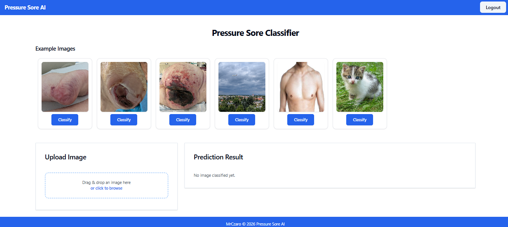
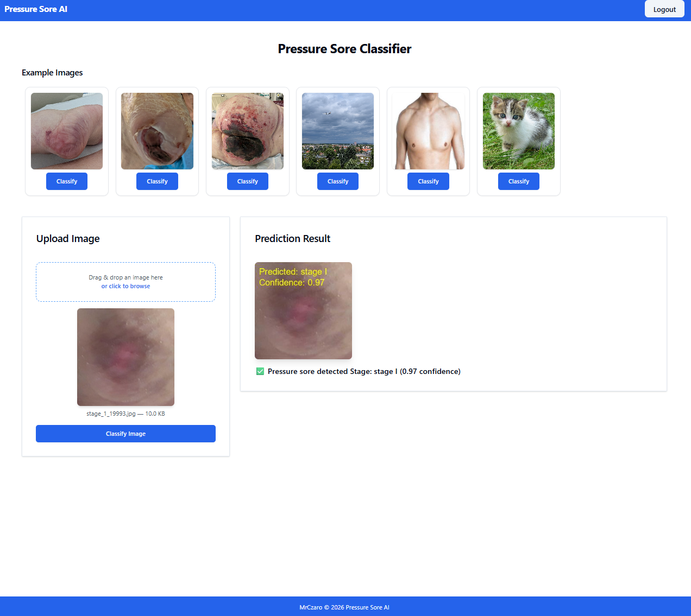
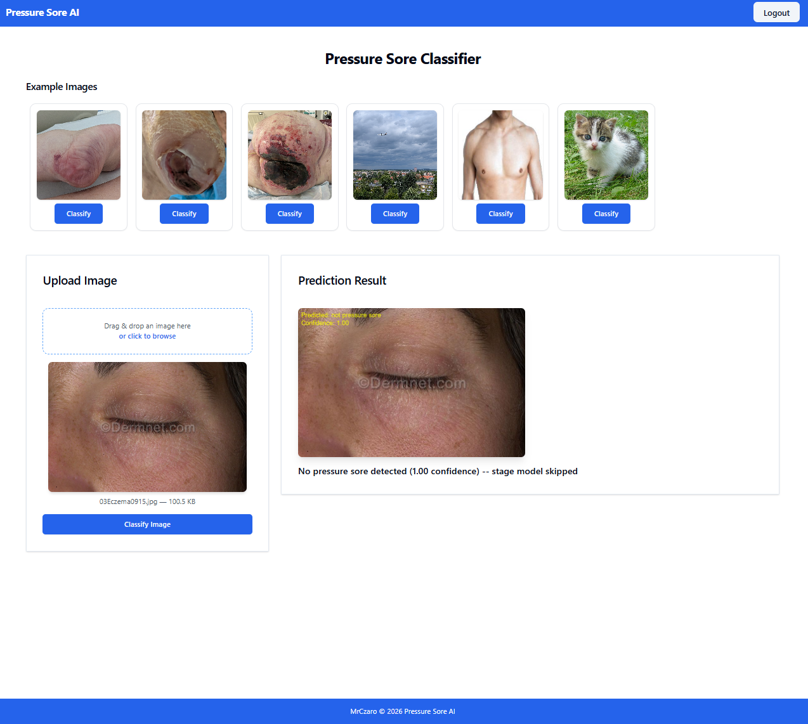
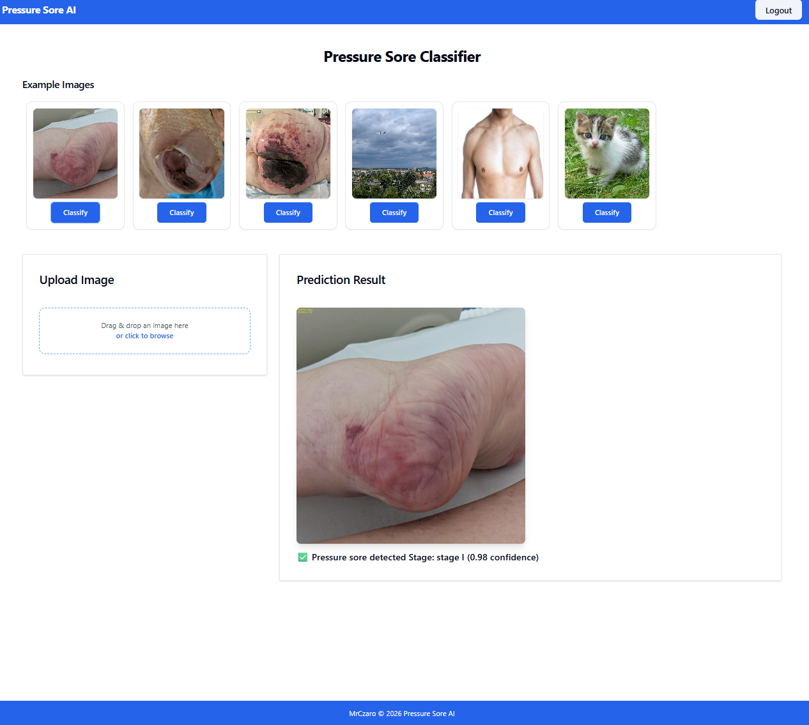
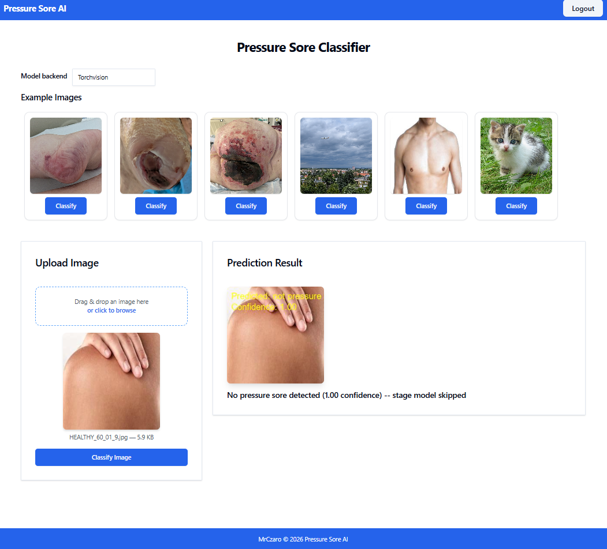
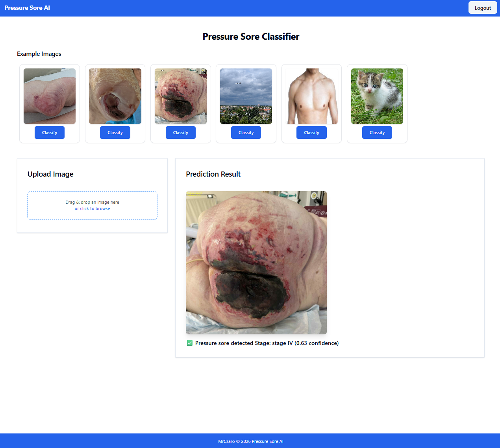
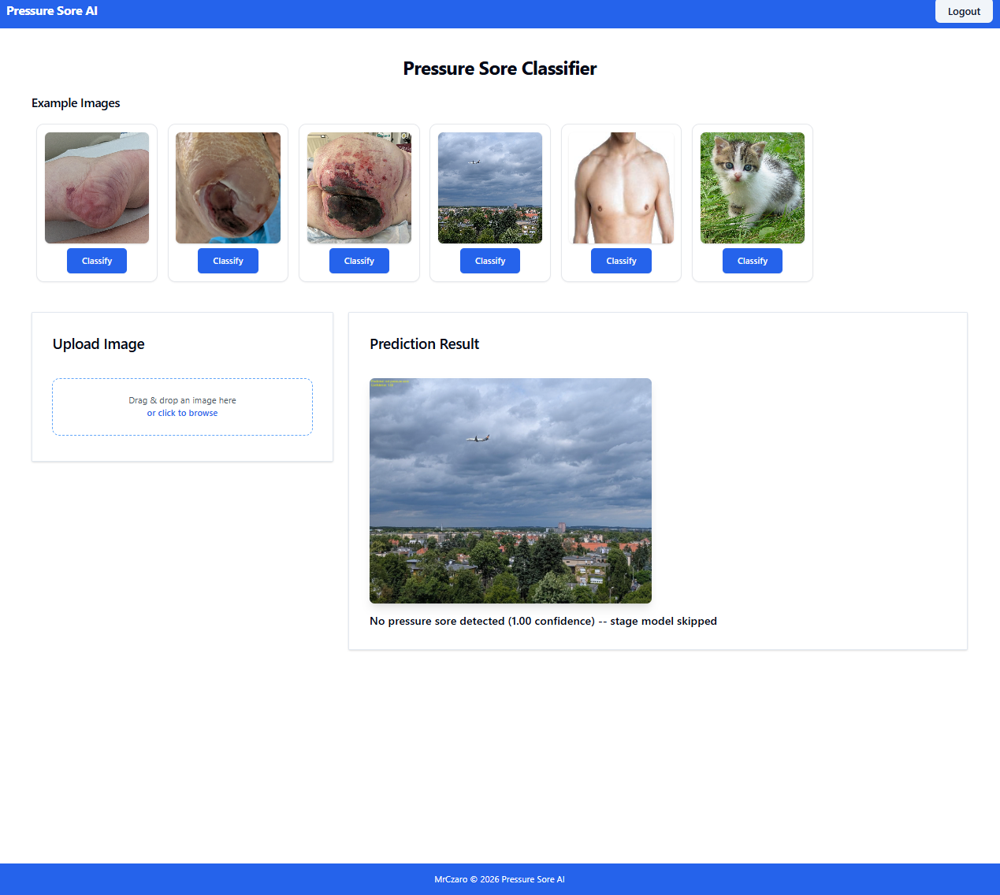
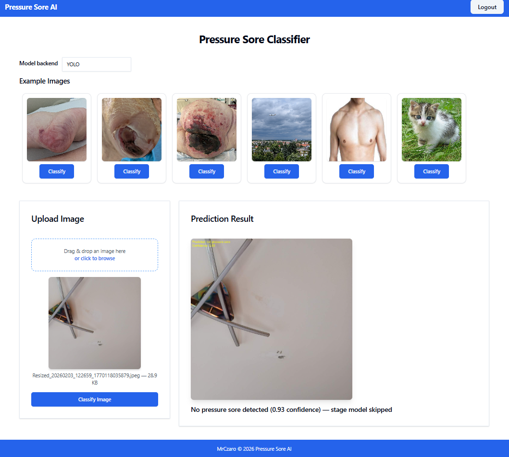
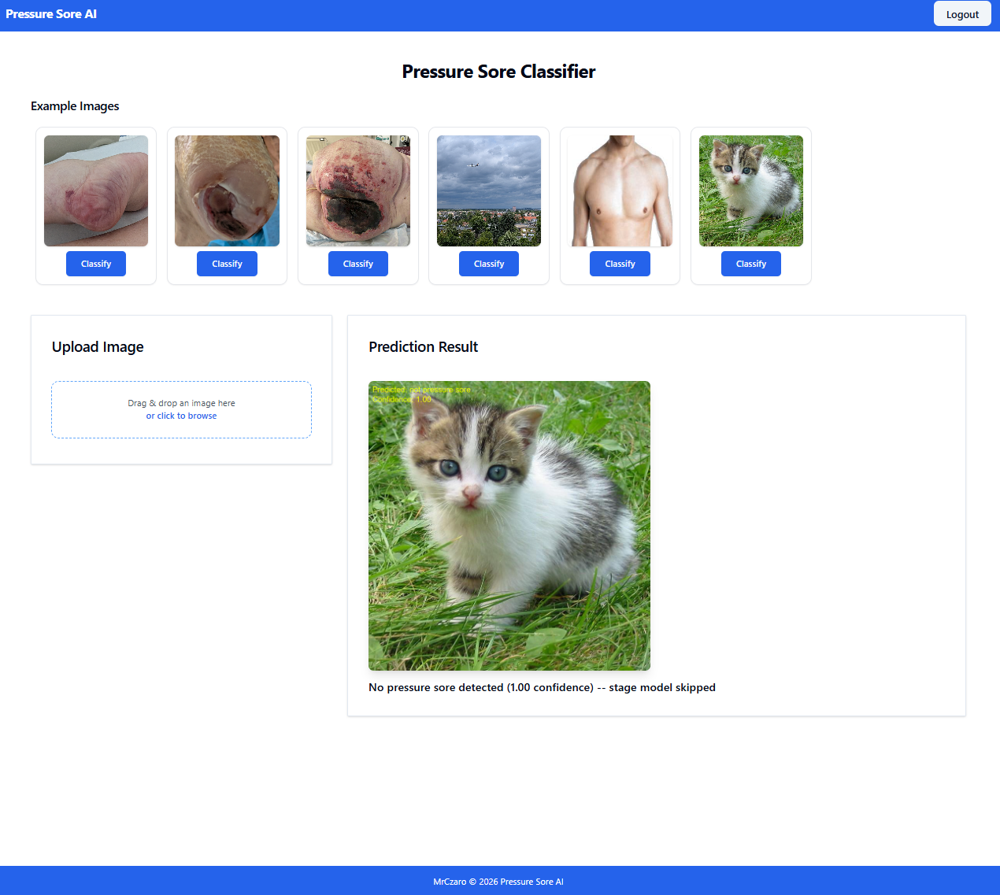

# Pressure Sore AI Classifier 🏥

[](https://www.python.org/downloads/)
[](https://pytorch.org/)
[](https://github.com/ultralytics/ultralytics)
[](https://fastht.ml/)
[](https://opensource.org/license/mit)

Deep learning web application for automated pressure sore (pressure ulcer) detection and severity classification using ensemble neural networks and cascade architecture.


---

## 📸 Application Preview

### User Interface
<table>
  <tr>
    <td width="100%">
      
      <p align="center"><b>Interactive Dashboard</b><br/>Upload images or select from examples</p>
    </td>   
  </tr>
</table>
<table>
  <tr>
    <td width="50%">
      
      <p align="center"><b>Drag & Drop Upload</b><br/>Seamless file handling with preview</p>
    </td>
    <td width="50%">
      
      <p align="center"><b>Drag & Drop Upload</b><br/>Seamless file handling with preview</p>
    </td>
  </tr>
</table>

### Model Performance Examples
<table>
  <tr>
    <td width="33%">
      
      <p align="center"><b>Stage I Detection PyTorch</b><br/>Early-stage pressure sore identification</p>
    </td>
    <td width="33%">
      
      <p align="center"><b>Negative Classification PyTorch</b><br/>Accurate rejection of non-pressure sores</p>
    </td>
    <td width="33%">
      
      <p align="center"><b>Advanced Stage Classification PyTorch</b><br/>Deep tissue damage assessment</p>
    </td>
  </tr>
</table>

<table>
  <tr>
    <td width="33%">
      
      <p align="center"><b>Stage I Detection YOLO </b><br/>Early-stage pressure sore identification</p>
    </td>
    <td width="33%">
      
      <p align="center"><b>Negative Classification YOLO</b><br/>Accurate rejection of non-pressure sores</p>
    </td>
    <td width="33%">
      
      <p align="center"><b>Advanced Stage Classification YOLO</b><br/>Deep tissue damage assessment</p>
    </td>
  </tr>
</table>

---

## 🎯 Project Overview

This project implements a **multi-stage cascade deep learning pipeline** for automated pressure sore detection and classification. The system combines multiple state of the art computer vision models an esnemble architecture to achive robust performance across three selectable backends. 

### Medical Context

**Pressure sores (pressure ulcers)** are localized injuries to skin and underlying tissue, typically over bony prominences, caused by prolonged pressure. They are staged from I to IV based on severity:

- **Stage I**: Non-blanchable erythema (redness) of intact skin
- **Stage II**: Partial-thickness skin loss with exposed dermis
- **Stage III**: Full-thickness skin loss (fat visible)
- **Stage IV**: Full-thickness tissue loss (muscle/bone exposed)

Early detection and accurate staging are critical for treatment planning and preventing progression.

---

## ✨ Key Features

### 🧠  Deep Learning Architecture


- **Cascade Classification Pipelines**: Two-stage (Torchvision) and three-stage (YOLO Cascade) approaches
- **Ensemble Modeling**: Combines multiple neural networks at every cascade level for robust predictions
- **Three Selectable Backends**: Switch between Torchvision ensemble, YOLO ensemble, and YOLO Cascade directly from the UI
- **Model Zoo**:
  - EfficientNet (B0, B1, B3, B4, V2-M)
  - Vision Transformers (ViT-B/16)
  - MaxViT, ConvNeXt, Swin V2
  - Wide ResNet-50, ResNet-50/152
  - YOLOv8, YOLO11 and YOLO26 (Ultralytics classification)
- **Advanced Architectures Tested**:
  - DINOv2 (Meta AI)
  - Custom PyTorch implementations


### 🔬 Cascade Approaches

#### Backend 1 — Torchvision: Two-Stage Ensemble
**Stage 1 — Binary Classification**
- Objective: Pressure sore vs. non-pressure sore
- Models: 5-model ensemble (ConvNeXt-Tiny, MaxViT-T, EfficientNet-B4, ResNet-50, Swin-V2-T)
- Output: Binary decision + confidence score

**Stage 2 — Multi-Class Staging (Conditional)**
- Objective: Classify severity (Stage I / II / III / IV)
- Activation: Only runs if Stage 1 detects a pressure sore
- Models: 2-model ensemble (EfficientNet-B1, EfficientNet-V2-M)
- Output: Stage prediction + confidence score

#### Backend 2 — YOLO: Two-Stage Ensemble
Same two-stage logic as Torchvision, using Ultralytics YOLO classification models at each stage.

**Stage 1 — Binary Classification**
- Models: 2-model YOLO ensemble (YOLO11l, YOLOv8l)
- Output: Binary decision + confidence score

**Stage 2 — Multi-Class Staging (Conditional)**
- Models: 2-model YOLO ensemble (YOLO11l, YOLOv8s)
- Output: Stage I / II / III / IV + confidence score

#### Backend 3 — YOLO Cascade: Three-Level Hierarchical Ensemble ⭐ NEW
Decomposes the hard 4-class staging problem into a tree of simpler binary decisions, mimicking the way a clinician thinks — detect first, triage severity, then refine within the group. Each level uses a 2-model YOLO ensemble.

**Level 1 — PS vs No-PS**
- Same binary YOLO ensemble as Backend 2 (weights reused)
- Output: Pressure sore present / absent

**Level 2 — Early (I/II) vs Advanced (III/IV)**
- Activated only when Level 1 is positive
- Objective: Coarse severity triage — is this an early or advanced wound?
- Models: 2 YOLO models trained specifically on the Early vs Advanced split
- Output: Severity group + confidence

**Level 3a — Stage I vs Stage II** *(Early branch)*
**Level 3b — Stage III vs Stage IV** *(Advanced branch)*
- Activated depending on the Level 2 decision
- Each is an independent 2-model YOLO ensemble trained only within its group
- Output: Final stage label + confidence

Each request returns a per-level `details` dict for logging and auditability:
```python
{
  "level_1": {"label": "pressure sore",  "confidence": 0.97},
  "level_2": {"label": "early",          "confidence": 0.84},
  "level_3": {"label": "stage II",       "confidence": 0.79, "group": "Early"}
}
```

### 🌐 Web Application

- **FastHTML Framework**: Modern Python web framework with HTMX
- **MonsterUI Components**: Beautiful, responsive Tailwind CSS + DaisyUI interface
- **Three-Backend Selector**: Toggle between Torchvision, YOLO, and YOLO Cascade in real time
- **Backend Badge**: Every result shows which backend produced it — useful for side-by-side comparison
- **Real-Time Inference**: Instant predictions via drag-and-drop or example selection
- **User Authentication**: Secure login/signup with bcrypt password hashing
- **Image Annotation**: Automatic overlay of predictions with confidence scores


---

## 🏗️ Architecture

### System Diagram

#### YOLO and PyTorch
```
┌─────────────────────┐
│   User Interface    │
│  (FastHTML + HTMX)  │
└──────────┬──────────┘
           │
           ▼
┌─────────────────────────────────────────────────────────────┐
│                    Image Input Pipeline                      │
│  • Upload (Drag & Drop)                                     │
│  • Example Gallery Selection                                │
│  • Preprocessing                                            │
└──────────┬──────────────────────────────────────────────────┘
           │
           ├──────────────────────┬
           │                      │ 
           ▼                      ▼          
    ┌──────────────┐      ┌──────────────┐        
    │   PyTorch    │      │     YOLO     │        
    │   Pipeline   │      │   Pipeline   │        
    │  (Active)    │      │ (Available)  │        
    └──────┬───────┘      └──────┬───────┘        
           │                     │
           └──────────┬──────────┘
                      │
                      ▼
         ┌────────────────────────────┐
         │   STAGE 1: Binary Detect   │
         │   Ensemble → Vote          │
         └────────────┬───────────────┘
                      │
              ┌───────┴────────┐
              │                │
         NO   │                │  YES
              │                │
              ▼                ▼
    ┌──────────────┐  ┌─────────────────┐
    │   Negative   │  │  STAGE 2: Stage │
    │     Return   │  │  Ensemble→Vote  │
    └──────────────┘  └────────┬────────┘
                               │
                               ▼
                    ┌──────────────────┐
                    │ Annotate + Return│
                    └──────────────────┘
```

#### YOLO Cascade

```
┌─────────────────────┐
│   User Interface    │
│  (FastHTML + HTMX)  │
│                     │
│  Backend selector:  │
│  ○ Torchvision      │
│  ○ YOLO             │
│  ● YOLO Cascade     │
└──────────┬──────────┘
           │
           ▼
┌──────────────────────────────────────────────────────────────┐
│                    Image Input Pipeline                       │
│  • Upload (Drag & Drop) or Example Gallery                   │
│  • Preprocessing (Resize, Normalize)                         │
└──────────┬───────────────────────────────────────────────────┘
           │
           ▼
╔══════════════════════════════════════════════════════════════╗
║          LEVEL 1: Binary Classification                      ║
║                                                              ║
║   ┌──────────────┐          ┌──────────────┐                ║
║   │   YOLO11l    │          │   YOLOv8l    │  (+ more)      ║
║   └──────┬───────┘          └──────┬───────┘                ║
║          └──────────┬─────────────┘                         ║
║                     ▼                                        ║
║             ┌───────────────┐                                ║
║             │   Ensemble    │                                ║
║             │   Averaging   │                                ║
║             └───────┬───────┘                                ║
║                     │                                        ║
║             Decision: Pressure Sore?                         ║
╚═════════════════════╪════════════════════════════════════════╝
                      │
          ┌───────────┴───────────┐
          │ NO                    │ YES
          ▼                       ▼
┌──────────────────┐  ╔══════════════════════════════════════════╗
│ Return Negative  │  ║   LEVEL 2: Severity Triage               ║
└──────────────────┘  ║                                          ║
                      ║  ┌──────────────┐  ┌──────────────┐     ║
                      ║  │  YOLO model  │  │  YOLO model  │     ║
                      ║  └──────┬───────┘  └──────┬───────┘     ║
                      ║         └────────┬─────────┘            ║
                      ║                  ▼                       ║
                      ║          ┌───────────────┐               ║
                      ║          │   Ensemble    │               ║
                      ║          └───────┬───────┘               ║
                      ║                  │                       ║
                      ║    Early (I/II) OR Advanced (III/IV)?    ║
                      ╚══════════════════╪═══════════════════════╝
                                         │
                          ┌──────────────┴──────────────┐
                          │ EARLY                        │ ADVANCED
                          ▼                              ▼
          ╔═══════════════════════╗    ╔═══════════════════════╗
          ║  LEVEL 3a             ║    ║  LEVEL 3b             ║
          ║  Stage I vs Stage II  ║    ║  Stage III vs Stage IV║
          ║                       ║    ║                       ║
          ║ ┌──────┐   ┌──────┐  ║    ║ ┌──────┐   ┌──────┐  ║
          ║ │YOLO 1│   │YOLO 2│  ║    ║ │YOLO 1│   │YOLO 2│  ║
          ║ └──┬───┘   └──┬───┘  ║    ║ └──┬───┘   └──┬───┘  ║
          ║    └────┬──────┘      ║    ║    └────┬──────┘      ║
          ║         ▼             ║    ║         ▼             ║
          ║    ┌─────────┐        ║    ║    ┌─────────┐        ║
          ║    │Ensemble │        ║    ║    │Ensemble │        ║
          ║    └────┬────┘        ║    ║    └────┬────┘        ║
          ║         │             ║    ║         │             ║
          ║   Stage I / Stage II  ║    ║ Stage III / Stage IV  ║
          ╚═════════╪═════════════╝    ╚═════════╪═════════════╝
                    └──────────────┬──────────────┘
                                   ▼
                       ┌───────────────────────┐
                       │   Annotate Image      │
                       │  (Label + Confidence) │
                       │  + Cascade Path Info  │
                       └───────────────────────┘
                                   │
                                   ▼
                       ┌───────────────────────┐
                       │   Return to User      │
                       │  (Base64-encoded PNG) │
                       │  + Backend Badge      │
                       └───────────────────────┘

```

### Data Flow

**Torchvision / YOLO (two-stage)**
1. Input → preprocessing → binary ensemble → pressure sore detected?
2. If YES → multi-class ensemble → Stage I / II / III / IV

**YOLO Cascade (three-level)**
1. Input → preprocessing → Level 1 binary ensemble → pressure sore detected?
2. If YES → Level 2 severity triage → Early group or Advanced group?
3. Early → Level 3a ensemble → Stage I or Stage II
4. Advanced → Level 3b ensemble → Stage III or Stage IV
5. Annotation with final label + cascade path, returned to user

---

## 🧪 Research & Development

### Experimental Approaches

This project represents iterative research exploring multiple deep learning paradigms:

#### ✅ Current Implementation 1 — Torchvision Two-Stage Ensemble
**Architecture**: Binary detection → Multi-class staging (4 classes)
**Rationale**: Mimics clinical workflow (detect first, then stage)
**Pros**: High specificity, interpretable confidence scores
**Challenge**: Stage III/IV differentiation remains difficult in a single 4-class head

#### ✅ Current Implementation 2 — YOLO Two-Stage Ensemble
**Architecture**: Binary YOLO → Multi-class YOLO (4 classes)
**Rationale**: Faster inference, simpler weight management with Ultralytics
**Pros**: Consistent API across backends, competitive accuracy

#### ✅ Current Implementation 3 — YOLO Cascade (Three-Level Hierarchical)
```
Level 1: Pressure Sore?
  └─ YES → Level 2: Early (I/II) vs Advanced (III/IV)?
              ├─ Early    → Level 3a: Stage I vs Stage II
              └─ Advanced → Level 3b: Stage III vs Stage IV
  └─ NO  → Return Negative
```
**Rationale**: Decomposes a hard 4-class problem into three easier binary decisions. Each model only needs to learn one boundary at a time, which reduces inter-class confusion — especially between Stage III and IV, which share similar visual features but differ significantly from Stage I and II.

**Key advantages over flat multi-class:**
- Smaller per-level label space → simpler decision boundary per model
- Level 2 and Level 3 models are trained only on the data relevant to their branch → less noise from unrelated classes
- Per-level confidence scores enable a joint `cascade_confidence` metric for flagging uncertain predictions for human review
- Failure modes are more interpretable — you can see exactly which level the model was uncertain at

**Challenge**: Requires separate labelled training sets for each cascade level. Stage I/II data must be isolated from Stage III/IV data for the Level 3 models.

#### 🔬 Alternative Approaches Tested

**1. Binary Cascade with Staged Routing**
```
Binary: Pressure Sore? 
  ├─ YES → Binary: Early (I/II) vs Advanced (III/IV)?
  │           ├─ Early → Binary: Stage I vs Stage II
  │           └─ Advanced → Binary: Stage III vs Stage IV
  └─ NO → Return Negative
```
**Status**: Prototyped in PyTorch  
**Outcome**: Showed promise for Stage III/IV separation but requires annotated quality data.

**2. YOLOv8/YOLOv11 Object Detection with Bounding Boxes**  
**Approach**: Detect pressure sores spatially in full images  
**Status**: Experimented with object detection framework  
**Outcome**: Classification mode (current approach) proved more effective than detection for this use case

**3. DINOv2 Self-Supervised Learning**  
**Approach**: Meta's self-supervised ViT for medical domain adaptation  
**Status**: Fine-tuned on collected dataset  
**Outcome**: Competitive performance but high computational cost (4× slower than YOLO)

---


### Dataset & Annotation

**Current Dataset**: ~1,000 images collected from public medical databases  
**Sources**: Medical journals, educational resources, research datasets  
**Annotation Status**: In progress - manual staging by clinical guidelines

**Note for YOLO Cascade**: Three additional binary label sets are derived from the main dataset - Early vs Advanced (all PS images), Stage I vs II (early subset only), Stage III and IV (advanced subset only).

**Future Work**: 
- Collect larger dataset 
- Collect time-series data (wound progression)

---

## 📊 Model Performance


### Backend 1 - Torchvision Binary Classification (Stage 1)

| Model | Accuracy | Precision | Recall | F1-Score |
|-------|----------|-----------|--------|----------|
| ConvNeXt-Tiny | 0.97 | 0.96 | 0.96 | 0.96 |
| MaxViT-T | 0.98 | 0.97 | 0.98 | 0.98 |
| EfficientNet-B4 | 0.99 | 0.99 | 0.99 | 0.99 |
| ResNet-50 | 0.99 | 0.98 | 0.98 | 0.97 |
| Swin-V2-T | 0.96 | 0.96 | 0.96 | 0.96 |
| **Ensemble** | **0.98** | **0.97** | **0.97** | **0.97** |

### Backend 1 - Torchvision Multi-Class Staging (Stage 2)

| Model | Accuracy | Macro F1 | Stage III/IV F1 |
|-------|----------|----------|-----------------|
| EfficientNet-B1 | 0.72 | 0.72 | 0.72 |
| EfficientNet-V2-M | 0.77 | 0.77 | 0.77 |
| **Ensemble** | **0.74** | **0.74** | **0.74** |

**Note**: Stage III vs Stage IV is the most challenging pair due to subtle visual differences requiring clinical context.


### Backend 2 - YOLO Binary Classification (Stage 1)

| Model | Accuracy | Precision | Recall | F1-Score |
|-------|----------|-----------|--------|----------|
| YOLOv11-Large | 0.99 | 0.99 | 0.99 | 0.99 |
| YOLOv8-Large | 0.99 | 0.99 | 0.99 | 0.99 |
| **Ensemble** | **0.99** | **0.99** | **0.99** | **0.99** |

### Backend 2 - YOLO Multi-Class Staging (Stage 2)

| Model | Accuracy | Macro F1 | Stage III/IV F1 |
|-------|----------|----------|-----------------|
| YOLOv11-Large | 0.77 | 0.77 | 0.77 |
| YOLOv8-Small | 0.85 | 0.85 | 0.85 |
| **Ensemble** | **0.81** | **0.81** | **0.81** |


---

### Backend 3 — YOLO Cascade: Per-Level Performance

#### Level 1 — Binary: PS vs No-PS

| Model | Accuracy | Precision | Recall | F1-Score |
|-------|----------|-----------|--------|----------|
| YOLOv26n-cls | 0.9962 | 0.9962 | 0.9962 | 0.9962 |
| YOLOv8x-cls  | 1.0000 | 1.0000 | 1.0000 | 1.0000 |
| **Ensemble** | **0.9981** | **0.9981** | **0.9981** | **0.9981** |

#### Level 2 — Binary: Early (Stage I/II) vs Advanced (Stage III/IV)

| Model | Accuracy | Precision | Recall | F1-Score |
|-------|----------|-----------|--------|----------|
| YOLOv8m-cls  | 0.9615 | 0.9645 | 0.9615 | 0.9616 |
| YOLOv26x-cls | 0.9615 | 0.9645 | 0.9615 | 0.9616 |
| **Ensemble** | **0.9615** | **0.9645** | **0.9615** | **0.9616** |

#### Level 3a — Binary: Stage I vs Stage II *(Early branch)*

| Model | Accuracy | Precision | Recall | F1-Score |
|-------|----------|-----------|--------|----------|
| YOLOv8n-cls  | 1.000 | 1.000 | 1.000 | 1.000 |
| YOLOv26x-cls  | 0.9286 | 0.9388 | 0.9286 | 0.9289 |
| **Ensemble** | **0.9643** | **0.9694** | **0.9643** | **0.9644** |

#### Level 3b — Binary: Stage III vs Stage IV *(Advanced branch)*

| Model | Accuracy | Precision | Recall | F1-Score |
|-------|----------|-----------|--------|----------|
| YOLOv8x-cls  | 0.9286 | 0.9388 | 0.9286 | 0.9289 |
| YOLOv26x-cls | 0.9286 | 0.9388 | 0.9286 | 0.9289 |
| **Ensemble** | **0.9286** | **0.9388** | **0.9286** | **0.9289** |

Despite being the hardest binary pair in the dataset, L3b improves substantially on the flat Torchvision Stage 2 ensemble (0.74 macro F1) by isolating the III/IV decision from unrelated Stage I/II samples. Selecting `yolov8x` and `yolo26x` — two architecturally distinct families both achieving identical top performance — maximises ensemble diversity without sacrificing accuracy.

---

### Backend 3 — YOLO Cascade: End-to-End Path Analysis

The joint cascade F1 is the product of ensemble F1 scores along each decision path — a conservative lower-bound on end-to-end performance, since errors at each level must compound for the whole chain to fail.

| Cascade Path | L1 F1 | L2 F1 | L3 F1 | Joint F1 |
|---|---|---|---|---|
| PS → Early → **Stage I or II**      | 0.9981 | 0.9616 | 0.9644 | **0.9256** |
| PS → Advanced → **Stage III or IV** | 0.9981 | 0.9616 | 0.9289 | **0.8916** |

Both paths comfortably exceed the flat Torchvision staging ensemble (0.74 macro F1). The Early path reaches **0.9256** — driven by the strong L3a ensemble where `yolov8n` achieved perfect test-set accuracy and `yolo26x` backed it with 0.9286. The Advanced path reaches **0.8916**, a significant improvement over both the previous L3b selection (0.8016) and the flat baseline, confirming that isolating the III/IV boundary from Stage I/II samples is the primary driver of performance gains at the hardest cascade level.

**NOTE**: Notebooks from this training pipeline are available in the project repository under the `notebooks/yolo_cascade` directory.
---


## 🚀 Getting Started

### Prerequisites

```bash
Python 3.11+
PyTorch 2.0+ 
Ultralytics (for YOLO and YOLO Cascade backends)
CUDA-capable GPU (recommended, CPU supported)
8GB+ RAM
```

### Installation

1. **Clone the repository**
```bash
git clone https://github.com/MrCzaro/PS_Classifier.git
cd PS_Classifier
```

2. **Create virtual environment**
```bash
python -m venv venv

# On Windows:
venv\Scripts\activate

# On macOS/Linux:
source venv/bin/activate
```

3. **Install dependencies**
```bash
pip install -r requirements.txt
```

4. **Obtain model weights** ⚠️

**Model weights are NOT included in this repository** due to size constraints.

**For access to weights**:
```
📧 Email: cezary.tubacki@gmail.com
💬 Subject: "PS_Classifier Model Weights Request"
📝 Include: Your intended use case (evaluation, research, etc.)
```

Once obtained, place the files in the `models/` directory:

**PyTorch Weights** (7 files, ~730MB):
```bash
mkdir models
# Add .pth files:
# - final_model_ConvNeXt_Tiny_v2_model_head_mlp_binary_StepLR.pth
# - final_model_MaxVit_T_v2_model_head_linear_binary_CosineAnnealingLR.pth
# - final_model_EfficientNet_B4_v2_model_head_mlp_binary_StepLR.pth
# - final_model_ResNet50_v2_model_head_mlp_binary_CosineAnnealingLR.pth
# - final_model_Swin_V2_T_v2_model_head_linear_binary_StepLR.pth
# - multiclass_EfficientNet_B1_Weights.IMAGENET1K_V2.pth
# - multiclass_EfficientNet_V2_M_Weights.IMAGENET1K_V1.pth
```

**YOLO Weights** (4 files, ~130MB):
```bash
# Add .pt files:
# - binary_yolo11l_aug_15_25.pt
# - binary_yolov8l-cls_best_aug_11.pt
# - mutliclass_yolo11l_aug_15_25.pt
# - multiclass_yolov8s-cls_best_aug_13.pt
```

**YOLO Cascade Weights** (8 files, ~160MB)
```bash
# Add .pth files:
# Level 1 — PS vs No-PS 
# - Level 1 Binary PS or not PS YOLO8x.pt
# - Level 1 Binary PS or not PS YOLO26x.pt

# Level 2 — Early (Stage I or II) vs Advanced (Stage III or IV)
# - Level 2 Early vs Advanced YOLO26x.pt
# - Level 2 Early vs Advanced YOLO8m.pt"

# Level 3a — Early group: Stage I vs Stage II
# - Level 3a Early YOLO8n.pt
# - Level 3a Early YOLO26x.pt

# Level 3b — Advanced group: Stage III vs Stage IV
# - Level 3b Advanced  YOLO8x.pt
# - Level 3b Advanced  YOLO26x.pt

```

5. **Initialize database**
```bash
# Database auto-creates on first run
# To reset:
rm users.db
```

6. **Run the application**
```bash
python main.py
```

7. **Access the web interface**
```
Open browser: http://localhost:5001
```

### First-Time Setup

1. **Create account**: Navigate to signup page
2. **Test with examples**: Click any example image to classify
3. **Upload custom image**: Drag and drop your own pressure sore images
4. **Review predictions**: See annotated results with confidence scores

---
 
## 🔑 Obtaining Model Weights

### Why Weights Are Not in Repository

**Model weights are NOT uploaded to this repository** due to file size constraints (~1.2GB total for both pipelines).

### How to Get Weights

**For Recruiters, Researchers, or Collaborators:**

I'm happy to share model weights for legitimate purposes:

```
📧 Email: [cezary.tubacki@gmail.com]
💬 Subject: "PS_Classifier Weights Request"
📝 Please include:
   - Your name and affiliation
   - Intended use case (portfolio review, research, evaluation, etc.)
   - Preferred delivery method (Google Drive, Dropbox, direct transfer)
```
---

## 💻 Usage

### Web Interface

**Selecting a backend**:
Use the "Model backend" dropdown to choose between Torchvision, YOLO, and YOLO Cascade before classifying. The active backend is shown as a badge on every result.

**Example Classification**:
1. Select a backend from the dropdown
2. Click any example image → "Classify"
3. View annotated result with prediction + confidence

**Custom Upload**:
1. Select a backend from the dropdown
2. Drag image into upload zone (or click to browse)
3. Click "Classify Image"
4. Results display with backend badge and cascade path info

### Programmatic API

```python
# Two-stage backends
from ps_classifier import classify_image_ps        # Torchvision
from ps_classifier_yolo import classify_image_ps   # YOLO

annotated_img, message = classify_image_ps("path/to/image.jpg")
print(message)
# "✅ Pressure sore detected\nStage: stage III\n(0.87 confidence)"

# Three-level YOLO Cascade — full detail
from ps_classifier_yolo_cascade import classify_image_cascade, cascade_confidence

final_image, message, details = classify_image_cascade("path/to/image.jpg")
print(message)
# "✅ Pressure sore detected
#  Severity group: early (0.84)
#  Stage: stage II (0.79)"

print(details)
# {
#   "level_1": {"label": "pressure sore", "confidence": 0.97},
#   "level_2": {"label": "early",         "confidence": 0.84},
#   "level_3": {"label": "stage II",      "confidence": 0.79, "group": "Early"}
# }

# Joint confidence across all three levels
print(cascade_confidence(details))  # 0.97 × 0.84 × 0.79 ≈ 0.644

# Drop-in wrapper (same signature as original classify_image_ps)
from ps_classifier_yolo_cascade import classify_image_ps as classify_cascade
annotated_img, message = classify_cascade("path/to/image.jpg")
```

### Batch Processing

```python
import os
from pathlib import Path
from ps_classifier_yolo_cascade import classify_image_cascade, cascade_confidence

input_dir  = Path("images/to_classify")
output_dir = Path("results/annotated")
output_dir.mkdir(exist_ok=True)

for img_file in input_dir.glob("*.jpg"):
    result_img, message, details = classify_image_cascade(str(img_file))

    if result_img:
        result_img.save(output_dir / img_file.name)

        with open(output_dir / "predictions.txt", "a") as f:
            joint_conf = cascade_confidence(details)
            f.write(f"{img_file.name}: {message.strip()} | joint_conf={joint_conf}\n")
```

---

## 🛠️ Technical Stack

### Core Technologies

- **Backend**: [FastHTML](https://fastht.ml/) - Modern Python web framework
- **Frontend**: [MonsterUI](https://monsterui.org/) - Tailwind CSS + DaisyUI components
- **Deep Learning**:
  - **PyTorch** - Neural network framework
  - **Ultralytics YOLO** - Object detection/classification framework
- **Computer Vision**: 
  - TorchVision (pretrained models)
  - Albumentations (augmentation - PyTorch only)
  - PIL (image processing)
- **Database**: SQLite (user management)
- **Auth**: Bcrypt (password hashing)
- **Real-time**: HTMX (dynamic updates)

### Model Architecture Details

**Binary PyTorch Models** (5 models):
```python
binary_models_settings = {
    "ConvNeXt_Tiny": ["models/torch/final_model_ConvNeXt_Tiny_v2_model_head_mlp_binary_StepLR.pth", "mlp"],
    "MaxVit_T": ["models/torch/final_model_MaxVit_T_v2_model_head_linear_binary_CosineAnnealingLR.pth", "linear"],
    "EfficientNet_B4": ["models/torch/inal_model_EfficientNet_B4_v2_model_head_mlp_binary_StepLR.pth", "mlp"],
    "ResNet50": ["models/torch/final_model_ResNet50_v2_model_head_mlp_binary_CosineAnnealingLR.pth", "mlp"],
    "Swin_V2_T": ["models/torch/final_model_Swin_V2_T_v2_model_head_linear_binary_StepLR.pth", "linear"]
}
```

**Stage PyTorch Models** (2 models):
```python
stage_models_settings = {
    "EfficientNet_B1": ["models/torch/multiclass_EfficientNet_B1_Weights.IMAGENET1K_V2.pth", "linear"],
    "EfficientNet_V2_M": ["models/torch/multiclass_EfficientNet_V2_M_Weights.IMAGENET1K_V1.pth", "linear"]
}
```

**YOLO Models**:
```python
BINARY_MODEL_PATHS = [
    "models/yolo/binary_yolo11l_aug_15_25.pt",
    "models/yolo/binary_yolov8l-cls_best_aug_11.pt",
]
STAGE_MODEL_PATHS = [
    "models/yolo/mutliclass_yolo11l_aug_15_25.pt",
    "models/yolo/multiclass_yolov8s-cls_best_aug_13.pt",
]
```

**YOLO Cascade** — 2 models per level, 4 levels, all `num_classes=1` binary:
```python
# Level 1 — PS vs No-PS 
L1_MODEL_PATHS = [
    "models/yolo_cascade/Level 1 Binary PS or not PS YOLO8x.pt",
    "models/yolo_cascade/Level 1 Binary PS or not PS YOLO26x.pt",
]

# Level 2 — Early (Stage I or II) vs Advanced (Stage III or IV)
L2_MODEL_PATHS = [
    "models/yolo_cascade/Level 2 Early vs Advanced YOLO26x.pt",
    "models/yolo_cascade/Level 2 Early vs Advanced YOLO8m.pt",
]

# Level 3a — Early group: Stage I vs Stage II
L3_EARLY_MODEL_PATHS = [
    "models/yolo_cascade/Level 3a Early YOLO8n.pt",
    "models/yolo_cascade/Level 3a Early YOLO26x.pt",
]

# Level 3b — Advanced group: Stage III vs Stage IV
L3_ADVANCED_MODEL_PATHS = [
    "models/yolo_cascade/Level 3b Advanced  YOLO8x.pt",
    "models/yolo_cascade/Level 3b Advanced  YOLO26x.pt",
]
```
---

## 📁 Project Structure

```
PS_Classifier/
├── main.py                         # FastHTML app — routes, backend selector, auth
├── ps_classifier.py                # Torchvision 2-stage pipeline
├── ps_classifier_yolo.py           # YOLO 2-stage pipeline
├── ps_classifier_yolo_cascade.py   # YOLO 3-level cascade pipeline   ← NEW
├── image_utils.py                  # Shared annotate_image() utility
├── components.py                   # UI components (cards, forms, layout)
├── examples_config.py              # Example image paths
├── passwords_helper.py             # Bcrypt password utilities
├── requirements.txt                # Python dependencies
├── users.db                        # SQLite database (auto-generated)
├── models/
|   |torch/                         # Model weights (.pth / .pt files)
│   │
│   │  — Torchvision weights —
│   ├── final_model_ConvNeXt_Tiny_*.pth
│   ├── final_model_MaxVit_T_*.pth
│   ├── final_model_EfficientNet_B4_*.pth
│   ├── final_model_ResNet50_*.pth
│   ├── final_model_Swin_V2_T_*.pth
│   ├── multiclass_EfficientNet_B1_*.pth
│   ├── multiclass_EfficientNet_V2_M_*.pth
│   │
|   |yolo/
│   │  — YOLO (two-stage) weights —
│   ├── binary_yolo11l_aug_15_25.pt
│   ├── binary_yolov8l-cls_best_aug_11.pt
│   ├── mutliclass_yolo11l_aug_15_25.pt
│   ├── multiclass_yolov8s-cls_best_aug_13.pt
│   │
|   |yolo_cascade
│   │  — YOLO Cascade weights —      ← NEW
│   ├── cascade_l2_early_vs_advanced_model1.pt
│   ├── cascade_l2_early_vs_advanced_model2.pt
│   ├── cascade_l3_early_stageI_vs_stageII_model1.pt
│   ├── cascade_l3_early_stageI_vs_stageII_model2.pt
│   ├── cascade_l3_adv_stageIII_vs_stageIV_model1.pt
│   └── cascade_l3_adv_stageIII_vs_stageIV_model2.pt
│
├── static/                         # Images and assets
│   ├── pressure_1.jpg
│   ├── pressure_2.jpg
│   ├── pressure_3.jpg
│   ├── no_pressure_1.jpg
│   ├── no_pressure_2.jpg
│   ├── no_pressure_3.jpg
│   ├── error_picture.jpg
│   ├── favicon.ico
│   └── preview.js
└── docs/
    └── screenshots/
```

## 🔒 Security & Privacy

**Medical Image Handling**:
- Images are NOT stored permanently (deleted after classification)
- No EXIF data is retained
- No patient identifiable information (PII) is collected

**User Authentication**:
- Bcrypt password hashing 
- Session-based auth with signed cookies
- SQL injection prevention via parameterized queries

**HIPAA Compliance Notes**:
- This is a demonstration/research tool
- NOT certified for clinical use without validation
- Users must ensure compliance when deploying

---


## 🤝 Contributing

Contributions welcome! This is a portfolio/research project, but I'm happy to collaborate.

**Ways to Contribute**:
- 🐛 Report bugs or issues
- 💡 Suggest new features or architectures
- 📊 Share datasets (with proper licensing)
- 📝 Improve documentation
- 🔬 Validate models on your data
- 🎨 Enhance UI/UX design

**Contact**:
- GitHub Issues: [PS_Classifier/issues](https://github.com/MrCzaro/PS_Classifier/issues)
- Email: [cezary.tubacki@gmail.com] 
---

## 📄 License

This project is licensed under the MIT License - see [LICENSE](https://opensource.org/license/mit) file for details.

### Medical Disclaimer

**⚠️ IMPORTANT**:  
This software is provided **"as is"** for **research and educational purposes only**. It is:

- ❌ **NOT** a medical device
- ❌ **NOT** certified for clinical diagnosis
- ❌ **NOT** a substitute for professional medical judgment
- ❌ **NOT** validated in clinical trials

**Always consult licensed healthcare professionals for medical diagnosis and treatment.**

Use at your own risk. The authors assume no liability for decisions made based on this tool's output.

---

## 🙏 Acknowledgments

- **PyTorch Team**: For the incredible deep learning framework
- **Ultralytics**: For the YOLO framework and excellent documentation
- **FastHTML Creators**: For making web development enjoyable again
- **Medical Community**: For publicly available educational resources
- **Researchers**: Authors of pretrained models (ImageNet, COCO, etc.)
- **Open Source**: Standing on the shoulders of giants

---


### Current Status: ✅ v1.0 - Dual Pipeline Demo
**Completed**:
- ✅ PyTorch cascade architecture (7 models)
- ✅ YOLO cascade architecture (4 models)
- ✅ Modular backend system
- ✅ Web app with authentication
- ✅ Real-time inference (PyTorch: ~200ms, YOLO: ~70ms)
- ✅ Mobile-responsive UI


---

## 📞 Contact & Support

**Author**: MrCzaro  
**GitHub**: [@MrCzaro](https://github.com/MrCzaro)
**Email**: cezary.tubacki@gmail.com  
**Project Link**: [PS_Classifier](https://github.com/MrCzaro/PS_Classifier)

**For**:
- Bug reports → [GitHub Issues](https://github.com/MrCzaro/PS_Classifier/issues)
- Feature requests → [GitHub Discussions](https://github.com/MrCzaro/PS_Classifier/discussions)


---


